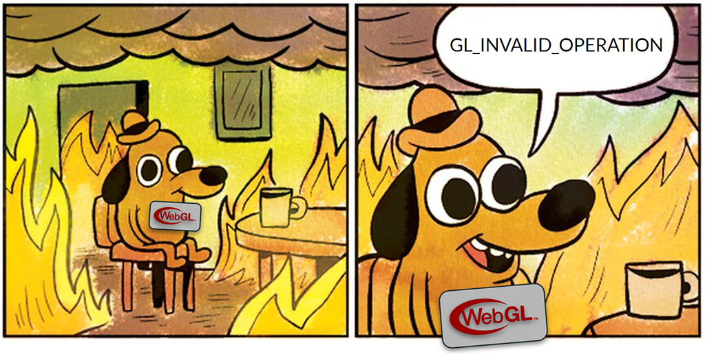

## Introduction

One of the challenges of working with any graphics API is that under the hood they tend to be very asynchronous in nature. The work you send to the GPU isn't completed the moment you call draw or dispatch, but instead is queued up to happen in the near future, once previously scheduled work is complete and the resources your work needs have been flagged as ready. And once your work is done there's even more synchronization that needs to happen before the results can be observed by your application. It's a lot to keep track of, though fortunately WebGPU does most of the heavy lifting for you when it comes to keeping things in sync.

This all happens in a different thread or even different process than the one that's running your JavaScript. That's great for performance, but one unfortunate side effect is that it's extremely difficult for browsers to clearly link any errors that may occur while performing GPU work to the JavaScript calls that ultimately caused those errors. Unlike typical exceptions, you won't be able to pause execution on the offending function and get a nice callstack and inspect variable state at your lesiure. Instead you'll usually get an error message that shows up in the console that has no associated line number.

Given the complex nature of GPU APIs, errors are _going_ to happen during development, so how do you handle them effectively in an environment like that?

### The bad old days

If you are familiar with WebGL or OpenGL, you may recall that it's error handling abilities... left something to be desired.

The short version was that at any point during you application you would call `gl.getError()`, which would stop your GPU's pipelining in it's tracks, force all current commands to finish, and then for your trouble give you one of a handful of vauge codes that represented the first error that happened since the last time someone called `gl.getError()`. If you wanted any control over which set of commands the error check covered you had to pepper your code with `gl.getError()` everywhere, which was an easy way to destroy your app's performance.



We can do better!

## Let the console do its thing!

The first thing to know is that if your application does no explicit error handling at all then any errors that do occur will display a detailed error message in your browser's developer console. And for a lot of apps, that's probably enough! The messages should give you enough information to find and fix the issue (especially if you help them out, more on that later!) and once any validation errors have been fixed other issues should be relatively rare. As a result, you shouldn't need to turn to more advanced error handling unless you have specific needs around responding to dynamic content, gracefully handling memory exhaustion, or gathering telemetry data.

## Error Scopes

In WebGPU the primary way for your application to intercept and respond to errors is through a mechanism called Error Scopes. Error Scopes are pushed onto a stack on the `GPUDevice` with a class of error that they capture (`validation`, `out-of-memory`, or `internal`). When popped they return a promise which resolves with the first error of that class (if any) that occured while that scope was on the top of the stack.

```js
// This example is pulled directly from the spec.
device.pushErrorScope('validation');

let sampler = device.createSampler({
    maxAnisotropy: 0, // Invalid, maxAnisotropy must be at least 1.
});

device.popErrorScope().then((error) => {
    if (error) {
        // There was an error creating the sampler, so discard it.
        sampler = null;
        console.error(`An error occured while creating sampler: ${error.message}`);
    }
});
```

The fact that the error scopes resolve asynchorously is important, as it allows the errors to be detected and reported without causing pipeline stalls on the GPU.

If you capture an error in an error scope then the associated human-readable message that normally would show up in the console in surpressed and instead given as the `message` attribute of the resoved error. There's no specific formatting rules around how these messages are formatted, and each implementation will do it a little differently. As a result, you **should not** attempt to parse them and react to the message contents programatically!

### Reacting to errors

Given that the message strings are intended for human consumption only, how your application responds to errors is going to be dictated by two things:

 - The type of error captured
 - The GPU calls the error scope covers

Consider the following hypothetical app startup code:

```js
// An example of poorly-structured error handling.
function onError(error) {
  console.log(`Something bad happened: ${error.message}`);
  device.destroy();
  shutDownApp();
}

device.pushErrorScope('out-of-memory');
device.pushErrorScope('validation');
device.pushErrorScope('internal');

for (const mesh in meshes) {
  loadMesh(mesh);
}

for (const shader in shaders) {
  createPipelines(shader);
}

device.popErrorScope().then(onError);
device.popErrorScope().then(onError);
device.popErrorScope().then(onError);
```

This isn't a particularly effective use of error scopes, because while it observes all possible types of errors it does so in a very broad way and takes the drastic action of immediately shutting down the entire app when any error does occur.

We can do better! First let's look at the different types of errors we can capture and what they mean:

 - **`validation`** errors occur whenever invalid inputs were given to a WebGPU call. These are consistent, predictable, and should generally not be expected during normal operation of a well formed application. They will fail in the same way on every device your code runs on, so once you've fixed any errors that show up during development you probably don't need to observe them directly most of the time. An exception to that rule is if you're consuming user-supplied assets/shaders/etc, in which case watching for validation errors while loading may be helpful.
 - **`out-of-memory`** errors mean exactly what they say: The device has run out of memory and can't complete the requested operation as a result. These should be relatively rare in a well behaved app but are much more unpredictable than validation errors because they are dependent on the device your app is running on in addition to what other things on the device are using GPU resources at the time.
 - **`internal`** errors occur when something happens in the WebGPU implementation that wasn't caught by validation and wasn't able to be clearly identified as an out of memory error. It generally means that an operation that you performed ran afoul some system limit in a way that was difficult to express with WebGPU's [supported limits](https://gpuweb.github.io/gpuweb/#gpusupportedlimits). The same operation might succeed on a different device. At the moment these can only be raised by pipeline creation, usually if the shader ends up being to complex for the device, but other situations might be added by the spec in the future.

Taking that into account, let's re-organize the above example to make better use of the error scopes:

```js
// An example of better error handling.
device.pushErrorScope('out-of-memory');

for (const mesh in meshes) {
  device.pushErrorScope('validation');
  loadMesh(mesh);
  device.popErrorScope().then((error) => {
    console.log(`${mesh.name} failed to load, replacing with default. Error: ${error.message}`);
    replaceWithDefaultMesh(mesh);
  });
}

for (const shader in shaders) {
  device.pushErrorScope('internal');
  createPipelines(shader);
  device.popErrorScope().then((error) => {
    console.log(`${shader.name} failed, falling back to a simpler shader. Error: ${error.message}`);
    replaceWithSimplifiedShader(shader);
  });
}

device.popErrorScope().then((error) => {
  console.log(`Out of memory, scene too large. Error: ${error.message}`);
  showUserDialog(`This scene was too large to be loaded.
    Close other applications and try again or try a smaller scene.`);
});
```

This works much better because the application can take a targeted action based on which error was raised and what was happening at the time. If a mesh fails to load then that single mesh can be replaced (perhaps with something like a model of large red 'ERROR' text?) rather than shutting down the entire program. If a shader is too complicated for the current device, a simpler one can be substitued in it's place.

The `out-of-memory` error scope still encompasses the entire load here, even though we could have made it more targeted too. But by isolating it's response from the other types of errors we can communicate more clearly to the user what's going on and give targeted instructions rather than simply failing.

In all cases we've used error scopes to improve the user experience.

### Potential pitfall: Async functions

One thing to watch out for when using error scopes, though, is to recognize that they can't automatically account for asynchronous code. For example, consider if the `loadMesh()` function used in the examples above looked like this:

```js
async loadMesh(mesh) {
  let response = await fetch(mesh.url);
  let arrayBuffer = await response.arrayBuffer();

  createMesh(mesh, arrayBuffer);
}
```

The `await`s at the beginning of that function would cause our error scope to no longer work, because when the code hits that await it'll pause execution of the function until the fetch returns and continue the `for` loop in the previous example. That means the flow of the JavaScript will be:

 - `pushErrorScope`
 - start `fetch`
 - `popErrorScope`
 - ... some time passes
 - `fetch`/`arrayBuffer` completes
 - `createMesh` runs

Which means that the error scope didn't actually cover any WebGPU calls (which are presumed to be in the `createMesh` method.)

Even worse is if the push/pop calls are moved inside the method, but still surrounding the await calls, like so:

```js
async loadMesh(mesh) {
  device.pushErrorScope('validation');
  let response = await fetch(mesh.url);
  let arrayBuffer = await response.arrayBuffer();

  createMesh(mesh, arrayBuffer);

  device.popErrorScope().then(/* ... */);
}
```

Because now the code is going to push one error scope onto the stack for every mesh before it's able to pop any of them. It would mean that when the code moves on to the pipeline creation loop the final validation error scope would still be active, and any validation errors that occured while creating the pipelines would then be attributed to one of these error scopes intended for observing mesh loading. Additionally, the error scopes will be popped effectively at random depending on when the `fetch`es resolve. Depending on exactly how you are using error scopes elsewhere in the application, that can cause chaos.

Instead, the best pattern is to only use error scopes to enclose synchronous sections of code. In our example function, that would mean doing this instead:

```js
async loadMesh(mesh) {
  let response = await fetch(mesh.url);
  let arrayBuffer = await response.arrayBuffer();

  device.pushErrorScope('validation');
  createMesh(mesh, arrayBuffer);
  device.popErrorScope().then(/* ... */);
}
```

## Uncaptured Errors

Error scopes are effective for situations where the application needs to take some action in response to a specific error, but in other cases you simply want to watch globally for any errors that occur and capture it somehow. For example, if you want to run some telemetry when your app is run by users.

In those cases you can listen to the `uncapturederror` event on the `GPUDevice` to pick up any errors that aren't intercepted by an Error Scope.

```js
device.addEventListener('uncapturederror', (event) => {
    // Re-surface the error.
    console.error('A WebGPU error was not captured:', event.error);

    reportErrorToServer({
        type: event.error.constructor.name,
        message: event.error.message,
    });
});
```

Like Error Scopes, listening to the `uncapturederror` event will prevent errors from showing up in the console, which may or may not be part of the desired effect for your app. If you want to ensure that the messages continue showing up in the console you'll need to repeat them yourself as shown in the above code snippet.

(Side note: If you are gathering errors for telemetry purposes it may also be beneficial to pair it with adapter information from [`adapter.requestAdapterInfo()`](https://gpuweb.github.io/gpuweb/#dom-gpuadapter-requestadapterinfo) so that you can see if there's a pattern behind what device types are seeing errors most frequently.)

## Shaders are special

One big exception to all of the above is shaders. Given that WGSL is a separate language that your application compiles at runtime, it makes sense to have a more detailed message reporting mechanism just for it.

To start, just like with other WebGPU errors, if you don't do anything then any messages generated at WGSL compile time will be displayed in the browser's developer console, and that should be sufficient for most basic debugging needs.

However, what if you were building a web application that supported soemthing like live shader editing? (See https://shadertoy.com as an excellent WebGL-based example.) In that case it would be extremely useful to get very detailed messages from the browser about shader errors, warnings, and other messages along with contextual information such as what line in the shader provoked the message. That way you could surface them in the application UI itself rather than requiring users to keep the developer console open all the time.

Fortunately, that's exactly what `shaderModule.getCompilationInfo()` provides you!

```js
const code = `
@fragment
fn fragmentMain() -> @location(0) vec4f {
  return vec3(1.0, 0.0, 0.0, 1.0);
}
`;

const shaderModule = device.createShaderModule({ code });

const compilationInfo = await shaderModule.getCompilationInfo();
for (const message of compilationInfo.messages) {

  let formattedMessage = '';
  if (message.lineNum) {
    formattedMessage += `Line ${message.lineNum}:${message.linePos} - ${code.substr(message.offset, message.length)}\n`;
  }
  formattedMessage += message.message;

  switch (message.type) {
    case 'error':
      console.error(formattedMessage); break;
    case 'warning':
      console.warning(formattedMessage); break;
    case 'info':
      console.log(formattedMessage); break;
  }
}
```

As you can see from the above code snippet, after creating a shader module you can request a `GPUCompilationInfo` object which contains any messages generated while the shader was compiling, including information about where in the shader string the error came from. (`getCompilationInfo` will always resolve to a `GPUCompilationInfo` object, and if there were no messages then the `messages` array will simply be empty.)

If we were to run the above snippet of code, we'd get back a message along the lines of:

```
🛑 Line 4:14 - vec3(1.0, 0.0, 0.0, 1.0)
    no matching constructor for vec3(abstract-float, abstract-float, abstract-float, abstract-float)
```

That's because we goofed up and typed `vec3` when we should have used `vec4`! Of course we didn't need to explicitly ask for this information if all we were going to do is echo it to the console, because the browser will already do that for us. But if we wanted to present this information in a more rich fashion, such as underline the problematic code in an editor, the compilation info error gives us everything we need.

## Debug Labels

We've talked a lot so far about different ways of capturing and responding to error messages, but we can also make the messages themselves more helpful.

One of the most powerful tools WebGPU gives you for debugging is the ability to give every object you create a label. This can be done at creation time as part of the descriptor.

```js
let device = await adapter.requestDevice({
  label: 'Primary Device'
});

let playerVertices = device.createBuffer({
  label: 'Player Vertices',
  size: PLAYER_MESH_VERTEX_SIZE,
  usage: GPUBufferUsage.VERTEX | GPUBufferUsage.COPY_DST
});

let playerTexture = device.createTexture({
  label: 'Player Texture',
  size: [1024, 1024],
  format: 'rgba8unorm',
  usage: GPUTextureUsage.TEXTURE_BINDING | GPUTextureUsage.COPY_DST
});
```

The label can also be retrieved and changed after object creation with the
`label` attribute:

```js
function recycleTexture(texture, newLabel) {
  console.log(`Recycling ${texture.label} texture as ${newLabel}.`);
  texture.label = newLabel;

  // Update texture data...
}
```

Labels are never required, but can be assigned to every object type in WebGPU: Devices, Pipelines, Shader Modules, Bind Groups, Layouts, etc. Setting a label has very little overhead, and should be done even for release versions of your app. They are allowed to be any string you want, the API does not attempt to interpret them for semantic meaning. The label's only job is to help you, the developer, recognize what object is being referred to.

Once a label is set it makes it easy to identify objects when stepping through code with a debugger or logging messages to the console. Those use cases alone would be enough to justify giving your objects labels, but they could have been accomplished without explicit API support. What makes WebGPU labels special is that they will help you identify problems at a much deeper level.

### Labels in error messages

WebGPU implementations will make use of the labels that you provide when reporting error messages to help you identify the problem faster. As mentioned above, there's no message formatting rules so each implementation will use labels differently. We'll use error messages returned from Chrome to demonstrate here, but you should get comprable results from most browsers that implement WebGPU.

Let's look at an example snippet of WebGPU code that has an error in it:

```js
// Create a vertex buffer
const vertexData = new Float32Array([
  0, 1, 1,
  -1, -1, 1,
  1, -1,
]);
const vertexBuffer = device.createBuffer({
  size: vertexData.byteLength,
  usage: GPUBufferUsage.INDEX | GPUBufferUsage.COPY_DST,
});
device.queue.writeBuffer(vertexBuffer, 0, vertexData);

// Draw
const commandEncoder = device.createCommandEncoder();
const passEncoder = commandEncoder.beginRenderPass(/*...*/);
passEncoder.setPipeline(pipeline);
passEncoder.setVertexBuffer(0, vertexBuffer);
passEncoder.draw(3);
passEncoder.end();

device.queue.submit([commandEncoder.finish()]);
```

Upon running the above code the browser will respond with an error message like the following, either in an enclosing error scope, the unhandled error event, or (if neither of those are present) the browser console.

```
⚠️[Buffer] usage (BufferUsage::(CopyDst|Index)) doesn't include BufferUsage::Vertex.
    - While encoding [RenderPassEncoder].SetVertexBuffer(0, [Buffer], 0).
```

This alone can help you spot the error! It points out that you're using a buffer as a vertex buffer that doesn't have the `VERTEX` usage. If you application is small enough that might be all you need to find and fix the problem.

But many WebGPU applications will be complex enough that simply saying "A buffer has the wrong usage" will be pretty ambiguous. You may have hundreds of buffers! Which one did it mean?

That's where labels come in! If you change the above buffer and render pass declarations to:

```diff
const vertexBuffer = device.createBuffer({
+ label: 'Player Vertices',
  size: vertexData.byteLength,
  usage: GPUBufferUsage.INDEX | GPUBufferUsage.COPY_DST,
});

const passEncoder = commandEncoder.beginRenderPass({
+ label: 'Primary Render Pass'
  /*...*/
});
```

The error message you get back will now look like:

```
⚠️[Buffer "Player Vertices"] usage (BufferUsage::(CopyDst|Index)) doesn't include BufferUsage::Vertex.
    - While encoding [RenderPassEncoder "Primary Render Pass"].SetVertexBuffer(0, [Buffer "Player Vertices"], 0).
```

Because the message now includes _which_ buffer was lacking the correct usage it's much easier for you to locate it and fix the issue. And if your application contained multiple render passes being able to differentiate the failing one can also be a big help while debugging.

## Debug Groups

In some cases even labeling every object may not give you the context you need. In order to help you identify what part of your code a particular error message was generated by, WebGPU also gives you the ability to set Debug Groups. A Debug Group works somewhat like an Error Scope, in that you push and pop them onto a stack, but their sole purpose is to be included in error messages to give you a better sense of where the problem occured. For example:

```js
const commandEncoder = device.createCommandEncoder();
commandEncoder.pushDebugGroup('Main Game Loop');

  const computePass = commandEncoder.beginComputePass({/*...*/});
  computePass.pushDebugGroup('Update Skinning');
    updateSkinning(computePass);
  computePass.popDebugGroup();
  computePass.end();

  const renderPass = commandEncoder.beginRenderPass({/*...*/});
  renderPass.pushDebugGroup('Primary Render Pass');
    renderPass.pushDebugGroup('Render Player');
      renderPlayer(renderPass);
    renderPass.popDebugGroup();

    renderPass.pushDebugGroup('Render Environment');
      renderEnvironment(renderPass);
    renderPass.popDebugGroup();
  renderPass.popDebugGroup();
  renderPass.end();

commandEncoder.popDebugGroup();
device.queue.submit([commandEncoder.finish()]);
```

This code snippet is using debug groups to effectively label the different parts of the command encoder that it's building. If an error occurs while encoding these commands the message will now look something like this:

```
⚠️[Buffer "Player Vertices"] usage (BufferUsage::(CopyDst|Index)) doesn't include BufferUsage::Vertex.
    - While encoding [RenderPassEncoder "Primary Render Pass"].SetVertexBuffer(0, [Buffer "Player Vertices"], 0).

    Debug group stack:
    > "Render Player"
    > "Primary Render Pass"
    > "Main Game Loop"
```

Which tells you pretty clearly that the error happened somewhere in the `renderPlayer()` function.

You can see that debug labels can be set across Command Encoders, Compute Pass Encoders, and Render Pass Encoders. They can go as many levels deep as you want as long as you have a balanced number of `push` and `pop` calls for each encoder. So this isn't valid:

```js
const commandEncoder = device.createCommandEncoder();

const computePass = commandEncoder.beginComputePass({/*...*/});
computePass.pushDebugGroup('Update Skinning');
  updateSkinning(computePass);
computePass.end(); // ERROR! Didn't pop the "Update Skinning" group before ending the pass!

commandEncoder.popDebugGroup(); // ERROR! Didn't push any Debug Groups in commandEncoder.
device.queue.submit([commandEncoder.finish()]);
```

Like labels, setting debug groups is pretty lightweight (assuming you don't go TOO crazy with them). As a result, developers are encouraged to use them as a standard part of their applications and not strip them out prior to release. That way any errors that your users encounter in the wild will have as much information as possible to help your debugging efforts!

## Debug Labels and Groups in native tools

One final thing to note about debug labels and groups is that D3D12, Metal, and Vulkan all have similar mechanisms. This means that WebGPU implementations can pass these values along to the underlying native APIs that they operate on top of. As a result, when using native GPU debugging tools such as [PIX](https://devblogs.microsoft.com/pix/) or [RenderDoc](https://renderdoc.org/) those tools will also be able to make use of the labels and groups that you set!

Fair warning: using such tools with a browser is tricky. The WebGPU data that they capture is likely to be mixed in with rendering commands for the rest of the page and the browser UI, and since WebGPU is not a 1:1 mapping of any of the native APIs the commands you issue to the GPU may be translated in unexpected ways. But having well labeled resources in your WebGPU app can make it much easier to find the corresponding native commands!
