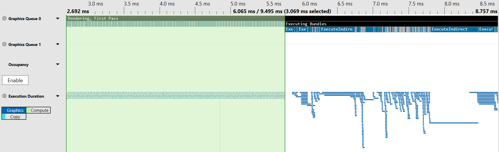
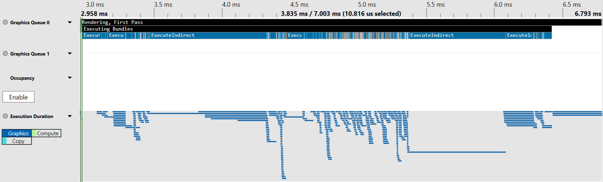

## TL;DR:

If you use indirect drawing as part of your WebGPU application, put as many of the indirect draw args as you can into a single `GPUBuffer`. That's it. That's the whole best practice.

_Temporary additional best practice: If running Chrome, use version 122 or higher. It includes a [significant optimization to indirect draw calls](https://bugs.chromium.org/p/dawn/issues/detail?id=2329). Chrome 122 is scheduled to be released as the stable version in late Feb 2024_


Okay, fine. So you probably want a few more details than that.

## What is an indirect draw?

WebGPU includes the ability to execute "indirect commands" such as drawing and compute dispatches. Executed with the [`drawIndirect()`](https://gpuweb.github.io/gpuweb/#dom-gpurendercommandsmixin-drawindirect), [`drawIndexedIndirect()`](https://gpuweb.github.io/gpuweb/#dom-gpurendercommandsmixin-drawindexedindirect), and [`dispatchWorkgroupsIndirect()`](https://gpuweb.github.io/gpuweb/#dom-gpucomputepassencoder-dispatchworkgroupsindirect) commands, these operate exactly like the non-indirect versions of these methods with the critical difference that the arguments for the call are read from a `GPUBuffer` instead of being passed directly.

So this draw call:

```js
renderPass.draw(vertexCount, instanceCount);
```

Is identical to this one:

```js
const drawBuffer = device.createBuffer({
  size: 16,
  usage: GPUBufferUsage.INDIRECT | GPUBufferUsage.COPY_DST
});
const drawArgs = new Uint32Array(4);
drawArgs[0] = vertexCount;
drawArgs[1] = instanceCount;
drawArgs[2] = 0; // First Vertex
drawArgs[3] = 0; // First Instance
device.queue.writeBuffer(drawBuffer, 0, drawArgs);

renderPass.drawIndirect(drawBuffer, 0 /* drawBuffer Offset */);
```

The reason that this is beneficial is because it allows the GPU to define work that needs to be done in a shader rather than explicitly communicating it from the CPU. An example of this in action is described in my [Render Bundle best practices doc](./render-bundles#indirect-draws), which provides an example of using indirect draws to perform frustum culling in a compute shader without any CPU readback.

## Why does the buffer it's in matter?

> NOTE: This section refers to implementation details of Chrome's WebGPU library, [Dawn](https://dawn.googlesource.com/dawn). It may not apply to other browsers. I will update it as I learn more details of how other WebGPU implementations handle this aspect of the API.

One of the core features of WebGPU in the context of the browser is that it validates all the commands that it executes to ensure (as much as possible) that developers can't trigger undefined behavior in the drivers on users device. In some cases we do these checks in the WebGPU implementation, such as verifying when you call `drawIndexed()` that the bound index buffer range has enough elements to cover the requested draw. Other times we can rely on hardware or driver features to do it for us, such as enabling various "robustness" features. These ensure, for instance, that if an index points to a vertex that's outside the bound vertex buffer ranges, we won't get memory from another process back.

When making indirect calls we don't have an opportunity to do CPU-side validation of the call args. (Unless we read them back out of the buffer first, but that would be incredibly slow!) So we need to get more creative about how we ensure those calls are safe.

On devices that use our Vulkan backend, like Android, Chrome is able to rely on the aforementioned [robustness features](https://registry.khronos.org/vulkan/specs/1.3-extensions/man/html/VK_EXT_robustness2.html) to ensure that shaders don't access memory not owned by the WebGPU device.

On devices using our Metal backend we opted to use ["vertex pulling"](https://www.yosoygames.com.ar/wp/2018/03/vertex-formats-part-2-fetch-vs-pull/) for all of our vertex attributes, and thus can do a bounds check at the time the vertex data is fetched.

On our D3D12 backend, however, we had the need to do some manual validation of the index count _and_ do some data copies for each indirect draw in order to ensure that the WGSL shaders receive correct values for the [`vertex_index`](https://gpuweb.github.io/gpuweb/wgsl/#vertex-index-builtin-value) and [`instance_index`](https://gpuweb.github.io/gpuweb/wgsl/#instance-index-builtin-value) builtins. To handle these operations efficently we inject compute dispatches that perform the necessary validations and copies at the beginning of render passes which make use of indirect draw calls.

As an optimization we try to batch these validations into as few dispatches as possible. The criteria for whether or not a particular indirect draw can be batched comes down to three things:

 - Is it an indexed or non-indexed draw?
 - Does the shader make use of the `vertex_index` and `instance_index` builtins?
 - The buffer that the indirect draw is stored in.

Those first two criteria are pretty basic and won't result in a lot of separate dispatches, so you really shouldn't need to give them much thought. The third criteria is critical, though!

If each indirect draw call you performed was stored in a separate buffer then there's no efficient way for us to validate them all in a single dispatch. Instead we need to kick off one compute dispatch _per indirect buffer_. If you have 100 indirect draw calls in your render pass, stored in 100 separate buffers, then that means your render pass is going to start with 100 "invislbe" compute dispatches before any rendering is done.

Worse, because these dispatches are not part of the actual native rendering pass the time they take to run isn't included in any timestamp queries you perform on the pass. As such, it's easy to look at just the pass timings and think "this is performing well!" when in reality you have a fairly large amount of hidden overhead.

## Okay, but how bad could it be, really?

Worse than you'd think!

To test this out I attached the [PIX D3D12 debugger](https://devblogs.microsoft.com/pix/) to Chrome and loaded up a WebGPU scene on one of my in-development pages. It rendered ~5000 mesh instances with **412 indirect draw calls** in it's main render loop, which doesn't strike me as a particularly large number. But, crucially, the initial version of this page had every indirect draw call in it's own `GPUBuffer`. When capturing the frame in PIX you can immediately spot the large block of compute dispatches being performed at the beginning of the render pass (highlighted here in green)



What this shows is that of the ~6ms that it takes to execute the render pass on this device, ~3ms of that time is just performing indirect draw validation! A full 50% of the "render pass" time isn't doing any rendering!

After a bit of refactoring, I combined the args for all 412 indirect draw calls into the same `GPUBuffer` and captured the frame again. The results were dramatically different:



The validation is still highlighted in green, but you'd be forgiven for missing it because it's now a tiny sliver off on the left side of the graph. By making _no changes other than combining the indirect draw buffers_ the validation overhead dropped from 3ms to just over 10μs (That's _microseconds_.) In other words it's now **300 times faster**.

Obviously performance is going to differ from device to device, and the potential time spent on validation will vary significantly based on the number of indirect draws being performed. Regardless, any time you have a chance to improve your frame times so significantly by doing a bit of additional memory management seems like time well spent.

## That's pretty terrible, actually! Shouldn't that be considered a Chrome bug?

You could make that argument, yeah. And in fact, it used to be worse! In the process of doing the debugging I mentioned above I found that out validation batching criteria was quite a bit more restrictive than it needed to be and [made some updates to Dawn](https://dawn-review.googlesource.com/c/dawn/+/170142) to ensure that it was significantly easier to hit the fast path here.

But the issue of validating args from different buffers is a fundamentally tricky one. We don't have an effective way to address multiple indirect buffers in a single dispatch, and while we could try to copy them all into a single buffer prior to validation as an optimization that would still involve executing many small buffer-to-buffer copies, which would carry it's own overhead. There may be more validation opportunities in the implementation that we can pursue in the future, but for now I'm satisfied with knowing that the fast path is relatively easy to hit with minimal code changes on the developer's part.

## Wrap up

As mentioned previously, this bit of advice is targeted squarely at Chrome/Dawn on Windows. The other backends don't perform this particular bit of validation, and other WebGPU implementations may choose to address this in a different manner.

But... it's not THAT difficult to batch the indirect args into larger buffers, and for the affected devices there's a *lot* of performance to be gained by doing so. And even on devices that don't have this validation step, making fewer, larger memory allocations is never going to be a bad thing for your performance. So go ahead and batch those args! Your (Chrome+Windows especially) users will thank you.
