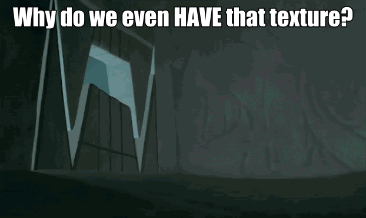

## Multisampling in WebGPU

Muli-Sampled Anti Aliasing (MSAA, also referred to as simply "multisampling") is an anti-aliasing technique that has been built into all GPU hardware for the last couple of decades, going all the way back to the introduction of the [ARB_multisample](https://registry.khronos.org/OpenGL/extensions/ARB/ARB_multisample.txt) OpenGL extension, introduced in 1999! The details of how it works are beyond the scope of this article, but there and many great resources online, [like this one](https://therealmjp.github.io/posts/msaa-overview/), that do an excellent job of explaining the technique.

In recent years MSAA has fallen out of favor with modern console and PC games in favor of upscaling techniques like [DLSS](https://www.nvidia.com/en-us/geforce/technologies/dlss/) and [FSR](https://www.amd.com/en/products/graphics/technologies/fidelityfx/super-resolution.html). But given that those techniques have yet to be exposed to WebGPU, and the fact that MSAA is ["almost free"](https://medium.com/androiddevelopers/multisampled-anti-aliasing-for-almost-free-on-tile-based-rendering-hardware-21794c479cb9) on mobile devices, MSAA still has a lot to offer when building 3D web content.

This article will cover how to get the most out of using MSAA with your WebGPU content.

## Basic multisampled rendering

There's a few minor differences that need to be taken into account when doing multisampled rendering with WebGPU.

First, when creating render pipelines, the number of samples must be specified.

```js
const msaaRenderPipeline = device.createRenderPipeline({
    label: `Multisampled pipeline`,
    vertex: {/*...*/},
    primitive: {/*...*/}
    depthStencil: {/*...*/},
    
    // This is the important bit!
    multisample: { count: 4, }

    fragment: {/*...*/},
})

```

(While this could in theory take in a variety of sample counts, functionally no browsers support anything other than 4.)

This pipeline can now only be used render to textures that also use 4 samples:

```js
const msaaColorTarget = device.createTexture({
    label: `Multisample Color Texture`,
    format: navigator.gpu.getPreferredCanvasFormat(),
    usage: GPUTextureUsage.RENDER_ATTACHMENT
    sampleCount: 4,
    size: { width: 1024, height: 1024 }
});

const msaaDepthTarget = device.createTexture({
    label: `Multisample Depth Texture`,
    format: `depth24plus`,
    usage: GPUTextureUsage.RENDER_ATTACHMENT
    sampleCount: 4,
    size: { width: 1024, height: 1024 }
});
```

Specifying a `sampleCount` of 4 creates a texture where each pixel is stored in memory as 4 "samples". Basically a texture that's 4x the size, but each group of 4 colors is treated as a single pixel. (And yes, it does take up 4x the memory. We'll talk about that in a bit.)

These textures can then be used as attachments for a render pass. The `sampleCount` of every texture attachment for the pass must match. You can't, for example, have a color target with 4 samples while your depth/stencil target only has 1.

```js
const commandEncoder = device.createCommandEncoder();
const msaaRenderPass = commandEncoder.beginRenderPass({
    label: `Multisample Render Pass`,
    colorTargets: [{
        view: msaaColorTarget.createView(),
        clearValue: [0, 0, 0, 0],
        loadOp: 'clear',
        storeOp: 'store',
    }],
    depthStencilAttachment: {
        view: msaaDepthTarget.createView(),
        depthClearValue: 1.0,
        depthLoadOp: 'clear',
        depthStoreOp: 'store',
    }
});

msaaRenderPass.usePipeline(msaaRenderPipeline);
msaaRenderPass.draw(3);

msaaRenderPass.end();
device.queue.submit([commandEncoder.finish()]);
```

This will fill the multisampled textures with the typical color and depth information from your rendering, just with 4 samples per-fragment instead of 1. This by itself isn't very useful, however. Most of the time you want to display the images you are rendering on the screen, and in the browser that means you have to render to the textures provided to you by a `GPUCanvasContext`. Unfortunately for us, you can't have the `GPUCanvasContext` produce multisampled textures!

Instead, you have to "resolve" the multisampled textures into a single sampled image first. To do this first you'll configure the canvas context to produce textures with the same size and format as the multisampled targets:

```js
canvas.width = 1024;
canvas.height = 1024;

const context = canvas.getContext('webgpu');
context.configure({
    format: navigator.gpu.getPreferredCanvasFormat(),
    // Canvas context textures default to a usage of RENDER_ATTACHMENT
});

// Later in the frame loop
const colorTexture = context.getCurrentTexture();
```

Alternatively you can also resolve to a texture you create normally via `device.createTexture()`, it just won't show up in the canvas.

```js
const colorTexture = context.configure({
    format: navigator.gpu.getPreferredCanvasFormat(),
    usage: GPUTextureUsage.RENDER_ATTACHMENT, // Required to use as a resolve target
    size: { width: 1024, height: 1024 }
    // sampleCount defaults to 1
});
```

Then you provide a texture view for that texture as the `resolve` argument of one of the `colorTargets`.

```js
const commandEncoder = device.createCommandEncoder();
const msaaRenderPass = commandEncoder.beginRenderPass({
    label: `Multisample Render Pass with Resolve`,
    colorTargets: [{
        view: msaaColorTarget.createView(),
        resolve: colorTexture.createView(),  // <-- This is the new bit!
        clearValue: [0, 0, 0, 0],
        loadOp: 'clear',
        storeOp: 'store`, // Oops! We'll talk about why this isn't good in a bit.
    }],
    depthStencilAttachment: {
        view: msaaDepthTarget.createView(),
        depthClearValue: 1.0,
        depthLoadOp: 'clear',
        depthStoreOp: 'discard',
    }
});

msaaRenderPass.usePipeline(msaaRenderPipeline);
msaaRenderPass.draw(3);

msaaRenderPass.end();
device.queue.submit([commandEncoder.finish()]);
```

What this does is wait till the end of the render pass, then copies the contents of the multisample `view` texture over to the single sample `resolve` texture. As it does so, it averages the color value of the 4 samples in the multisample texture and writes that averaged value into the single sampled texture. This is what gives the final image it's nice, antialiased appearance!

TODO: Image example.

And that's it! Easy, right?

## Taking advantage of the tile cache

Not so fast! While the above code works it can be done better. Specifically, it can be updated to take advantage of the architecture of GPUs that use Tile-Based Rendering (TBR), like many mobile GPUs.

The full details of how tile-based rendering works are out of scope for this article, but the important part to understand is that rather than rendering all the pixels affected by a single draw call at once, then moving on to the next draw call, tile-based renderers process all of the draws that affects a small rectangle (tile) of the output texture at once, then move on to the next tile and do it again.

The benefit of this is that the GPU can handle all of the drawing in a small, very fast chunk of cache memory which only needs to be written out to the output texture (stored in slower VRAM) when the tile is finished.

How does that affect multisampling?

// TODO

```js
const commandEncoder = device.createCommandEncoder();
const msaaRenderPass = commandEncoder.beginRenderPass({
    label: `Multisample Render Pass with Resolve`,
    colorTargets: [{
        view: msaaColorTarget.createView(),
        resolve: colorTexture.createView(),
        clearValue: [0, 0, 0, 0],
        loadOp: 'clear',
        storeOp: 'discard`, // <-- Updated. Much better for peformance!
    }],
    depthStencilAttachment: {
        view: msaaDepthTarget.createView(),
        depthClearValue: 1.0,
        depthLoadOp: 'clear',
        depthStoreOp: 'discard', // <-- Works for depth/stencil too!
    }
});

msaaRenderPass.usePipeline(msaaRenderPipeline);
msaaRenderPass.draw(3);

msaaRenderPass.end();
device.queue.submit([commandEncoder.finish()]);
```

Note that setting the `storeOp` to `'discard'` doesn't prevent the resolve from happening! `colorTexture` will still contain the final result of the render pass. It just tells the GPU that you don't care about making sure that the content of the MSAA texture is preserved.

Similarly, by using a `loadOp` of `'clear'` instead of `'load'` we are telling the GPU that we don't need to spend precious bandwidth pulling data out of the multisample texture before we start rendering, it can just initialize the cache to the given color. Oh, and the same concept applies to the depth stencil texture as well!

Taken together these load/store operations eliminate the bandwidth needed to copy the tile results to and from the multisampled texture. And since it's only taking time to copy out the single-sampled results, that makes the multisampled approach not "cost" much more than doing things single-sampled in the first place.

Of course, there are some rendering techniques that will require you to load or preserve the MSAA texture contents, and in that case you'll just have to eat the additional overhead (or use single sampling). The important part is to make sure you're not using `'load'` or `'store'` if you don't need to, because at that point you're introducing significant overhead on mobile (where you can afford it the least!) for no good reason.

## Using Transient Attachments

You may be asking yourself "wait a second, if we're not _loading_ the contents from the MSAA texture, and we're not _storing_ the contents to the MSAA texture, and the actual processing is being done in the cache... why do I need to allocate the memory for the MSAA texture in the first place?



Good question! And the answer is: You don't! ...*On tile-based renderers.* On your typical desktop GPU you still need some memory allocated for the driver to use as a scratch pad, even if you don't care about the results being stored later. Of course, this being the web we want to ideally implement something that works for both scenarios.

That's where *transient attachments* come in! A transient attachment is a texture that we create with a hint to the GPU that we don't care about it's contents and will only ever use it as a render attachemnt. In WebGPU that looks like this:

```js
const msaaColorTarget = device.createTexture({
    label: `Transient Multisample Color Texture`,
    format: navigator.gpu.getPreferredCanvasFormat(),
    usage: GPUTextureUsage.RENDER_ATTACHMENT | GPUTextureUsage.TRANSIENT_ATTACHMENT, // <-- New Usage!
    sampleCount: 4,
    size: { width: 1024, height: 1024 }
});

const msaaDepthTarget = device.createTexture({
    label: `Transient Multisample Depth Texture`,
    format: `depth24plus`,
    usage: GPUTextureUsage.RENDER_ATTACHMENT | GPUTextureUsage.TRANSIENT_ATTACHMENT, // <-- Works for depth/stencil too!
    sampleCount: 4,
    size: { width: 1024, height: 1024 }
});
```

This basically tells the GPU "You don't have to allocate memory for this if you don't want to!" And on tile-based renderers it probably wont! You're still likely to get an allocation on desktop GPUs, but that's OK because they've usually got more power/memory to spare.

As you might expect there are some limitations that come with using a transient texture. You _must_ pair the `TRANSIENT_ATTACHMENT` usage with the `RENDER_ATTACHMENT` usage and nothing else. (Which makes sense. You can't sample from texture memory that may not be there, right?) And when using the texture as a render pass attachment you _must_ use `loadOp: 'clear'` and `storeOp: 'discard'` (or the depth/stencil equivalents). These rules will be enforced by WebGPU's internal validation, but given that's what we were already doing in our prior example it shouldn't be a problem!

Now the GPU can keep all the multisampled targets in tiled memory _and_ we don't have to waste texture memory! Easy win!

> **Compatibility Note**: Transient attachments are a core part of the WebGPU spec, and so you should eventually be able to use them everywhere. They were a relatively late addition to the spec, however, so at the time of this writing they are implemented in Chrome (shipped in v146), but haven't been added to Firefox ([issue](https://bugzilla.mozilla.org/show_bug.cgi?id=2005061)) or Safari. They will both implement transient attachments in a future release.
>
> In the meantime, you can easily "polyfill" transient textures on those browser with a single statement at the top of your code:
>
> ```js 
> // Ensure TRANSIENT_ATTACHMENT can be used on unsupported browsers.
> GPUTextureUsage.TRANSIENT_ATTACHMENT = GPUTextureUsage.TRANSIENT_ATTACHMENT ?? 0;
> ```
>
> This works because `TRANSIENT_ATTACHMENT` is a just an optimization hint, and it's perfectly fine if the memory is actually allocated. This doesn't provide the associated validation, however, so be sure to test on a browser that does support transient attachments first.

## Depth Resolve

There's a funny edge case with using MSAA that may not be obvious at first. While many render techniques don't need to preserve the contents of the depth buffer once the render pass is complete, there's also plenty of techniques that require it! [Screen space ambient occlusion](https://en.wikipedia.org/wiki/Screen_space_ambient_occlusion) is a good example, as it relies on both the scene depth and normals. For any of your color targets, such as a texture containg the scene normals, you simply need to provide the [GPURenderPassColorAttachment](https://gpuweb.github.io/gpuweb/#dictdef-gpurenderpasscolorattachment) a `resolve` texture view, as shown above. Easy!

But you'll likely find out very quickly that there's no such `resolve` field on the [`GPURenderPassDepthStencilAttachment`](https://gpuweb.github.io/gpuweb/#dictdef-gpurenderpassdepthstencilattachment)! So how do you get that depth data into a form where you can sample from it?

There's a couple of approaches that you can use here. First off, it's worth noting that all of these techniques require that you `'store'` the depth\stencil contents, which means that you can't use `TRANSIENT_ATTACHMENT` for those attachments and you'll be paying the cost for storing out the full multisample texture. As established above this can be significantly more expensive on tile-based renderers vs. using `'discard'`, so keep that in mind and budget your rendering accordingly.

// TODO: Manual resolve to a single sample texture.

Alternatively, you could use the multisample texture directly, skipping the intermediate "resolved" texture produced above, but this is likely to be most effective in a scenario where you're only loading each depth fragment once or twice for the technique. If you're likely to be sampling the same depth values multiple times you should consider resolving to a single-sample texture first.


