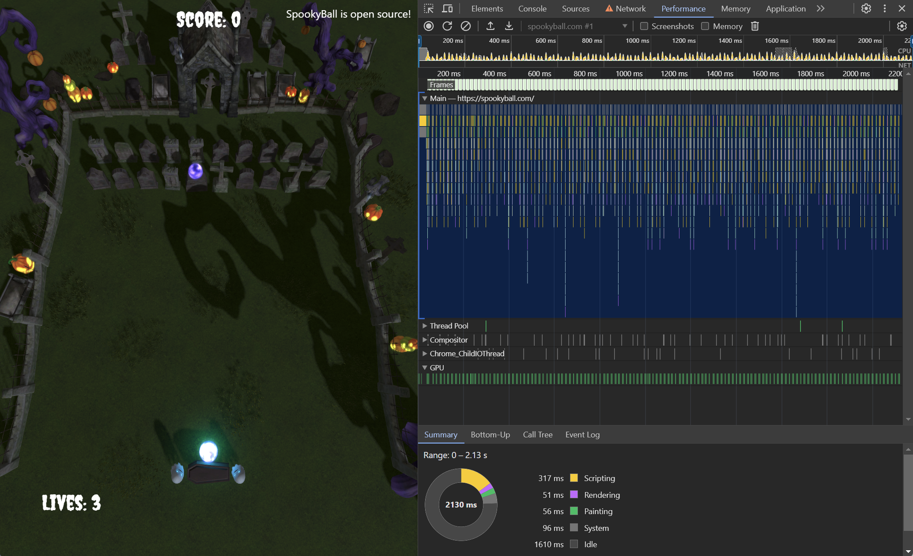
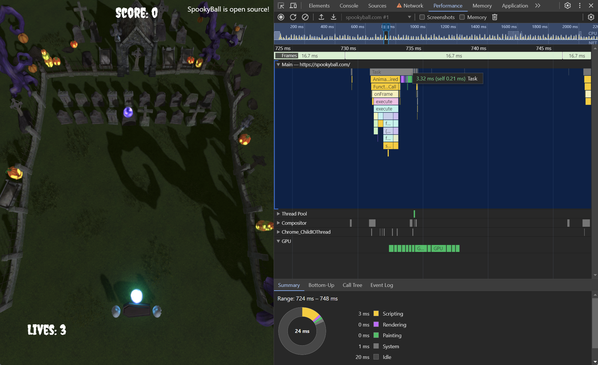
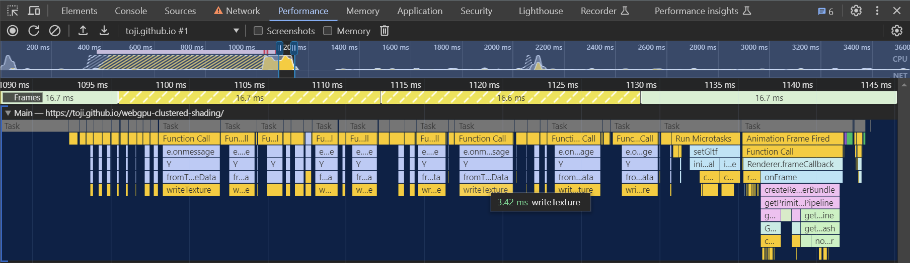
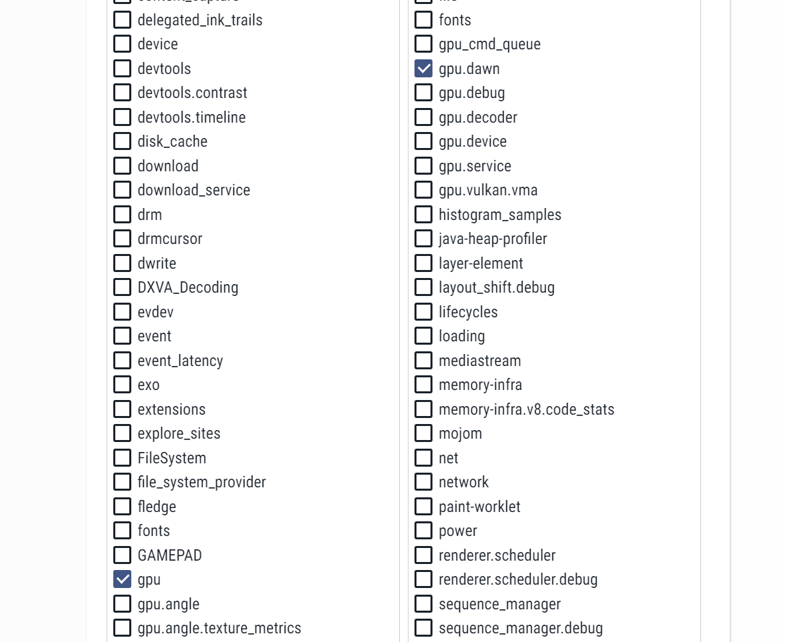
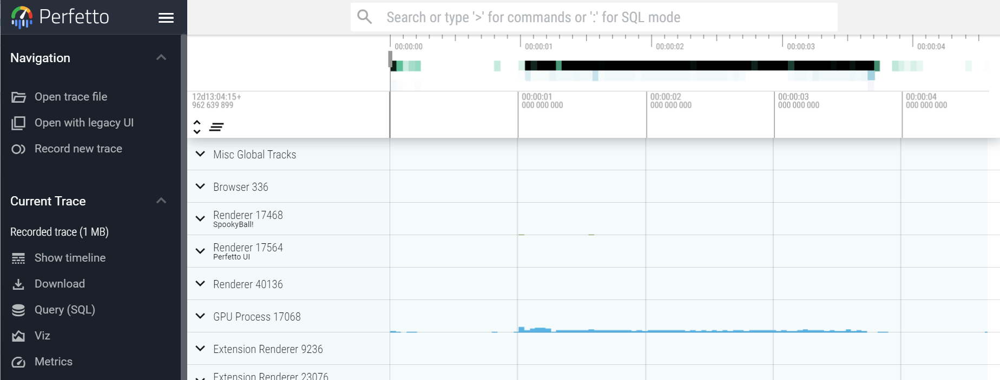
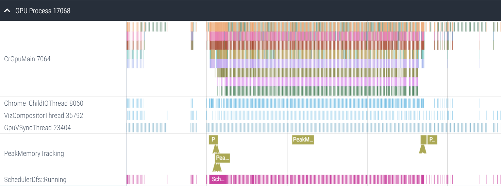

## Introduction

Realtime graphics have always been interested in pushing the highest performance levels possible for your device. And even though most people don't immediately associate the web with "high performance", WebGPU is really no different. The API has been designed to allow higher performance in more scenarios than WebGL, making use of many of the patterns of the modern native APIs.

But achiving high performance, no matter what your development environment, is almost impossibly without also having way to accurately observe the performance of your code. WebGPU is no different, but it runs into the unfortunate reality of existing in a stange in-between space of running in a browser but not behaving like most browser-based APIs, while also using many of the same facilities of games and other graphically intense apps while using a significantly different architecture from than those applications traditionally employ. This can make it difficulty to easily profile the performance of your WebGPU code running in a browser.

> Note: This document will focus on using various tools to observe what browser-based WebGPU is doing under the hood. The techniques presented will probably not apply to apps using native WebGPU implementations like [Dawn](https://dawn.googlesource.com/dawn) and [wgpu](https://wgpu.rs/) directly.
>
> Additionally, the profiling techniques shown here are largely going to be Chrome-centric because that's the browser I work on, but I would love to add similar steps for other browsers if anyone wants to reach out and help provide the steps to do so!

## CPU-side profiling

While we are using a GPU API, it's worth noting that your first stop when monitoring performance should be to ensure the _CPU_ side of things is running smoothly. After all, if you are trying to run your rendering at 60 frames per second but you're spending 30ms in JavaScript to submit the commands for each frame then you're simply never going to hit your target no matter how fast your GPU is!

### Chrome dev tools

The first place you should turn to in any web profiling situation is the browser's [built-in dev tools](https://developer.chrome.com/docs/devtools). If you're a web developer you're probably already familiar with at least some of these tools for viewing the developer console, setting breakpoints, and stepping through code. In not, [go read up on it](https://developer.chrome.com/docs/devtools/overview)! They're incredibly useful!

For profiling specifically you'll want to pay attention to the [Performance tab](https://developer.chrome.com/docs/devtools/performance). This tab allows you to record profiling snapshots of the page while it's running, which can then be displayed as flame graphs. Here's an example of me capturing a couple of seconds of [spookyball.com](https://spookyball.com)

We can zoom in with the scroll wheel to see a single frame's worth of calls.

The frame boundaries are shown at the top of the graph here, and you can see in this case the frame's JavaScript calls fit nicely within them. Mousing over the top of the graph shows that it only takes up 3.3ms out of the 16.7ms available to process the frame for our code to execute. That's great!

Here's an example of a profile from a different page where I missed the frame budget. In this case it was because the page was loading a lot of textures all at once and a high number of consecuitive `writeTexture()` calls (each taking about 3ms) caused the page to miss a few frames. This happened to be during page load, so I'm OK with it, but the point is that the flame graph can tell me where my JavaScript is spending it's time so I can focus optimizations where needed. (A good optimization option here, if I wanted it to be smoother, would be to force these `writeTexture()` calls only perform once or twice per frame, staggering them across multiple frames.)

Something to note, however, is that given the nature of how they're profiled, this graph will likely _not_ show you the timing for every method you call! The sampling will frequently skip over short calls or group many adjacent calls to the same function into one bar on the graph. That means you'll see things like just a `beginRenderPass()` call show up but none of the calls within that pass. Or you'll see a single `setBindGroup()` block that seems fairly large, but in actuality represents a group of them being called in quick succession. Long running calls are far more likely to be captured accurately, though, so it's still a highly effective tool for identifying bottlenecks.

A word of caution, though: The performance tab generally only captures the code being run by the page being profiled. Browsers are complex applications that frequently coordinate lots of work between not only different threads but entirely different processes! As a result, this only shows us the surface level of the work being done. To drill deeper we need a tool like...

### Perfetto

[Perfetto](https://ui.perfetto.dev/) is a general profiling tool that was designed to replace the older cross-process tracing utility found in Chrome (which you can still access by navigating to chrome://tracing a the time of this writing.) It allows us to capture profiles of what's happening in Chrome's GPU process, among others, which is the process that actually interfaces with the GPU driver.

Whereas the Chrome dev tools can easily show how much time the page is spending in JavaScript calls, these browser-wide traces can reveal if there are bottlenecks occuring in the WebGPU implementation as it communicates with the graphics hardware.

You'll want to reference [the Perfetto docs](https://perfetto.dev/docs/quickstart/chrome-tracing) for all the details on how to capture a trace in Chrome, but the high level steps are:
 
 - Select "Record a new Trace" from the menu on the left
 - If it's your first time running the tool, install the [Perfetto Chrome extension](https://chrome.google.com/webstore/detail/perfetto-ui/lfmkphfpdbjijhpomgecfikhfohaoine)
 - Select "Chrome" as the target platform
 - Under the "Probes" section select the catergories you want to profile

That last step can look pretty intimidating, because there's a LOT of them. The good news is that if you're here for WebGPU profiling you don't need most of them! Typically I'll only enable the `gpu.dawn` category in the right column.

Then you can click "Start Recording", at which point you'll want to switch back to the tab your WebGPU code is running in, let it run for a moment (maybe performing some action you're trying to profile), then switch back to the Perfetto tab and click "Stop".

> Note: This captures data from _everything_ running in the browser at that point, which means every tab, all the extensions you have running, every background process, etc. I highly recommend minimizing the number of open tabs you have in the browser when you do this, just to reduce the noise. (Frequently I do this sort of profiling in Chrome canary so that I can have it only open the relevant pages and not capture the dozens/hundreds of tabs I almost certainly have open in my main browser.)

That will provide you with a screen that looks like this:

To see the browser's GPU communication, expand the row labeled "GPU Process" to see another flame graph.

To navigate this graph you'll need to use the "W" and "S" keys to zoom in and out, and the "A" and "D" keys to move left and right.

// TODO: Good example cases (Shader compilation)

## GPU-side profiling

The other side of the performance coin is GPU profiling. That is: measuring how much time your GPU is spending completing the work you give it. The nature of GPU APIs is that they can kick off massive amounts of work with only a few commands, and it doesn't do too much good to see that we only spent 2ms sending those instructions to the GPU if we can't also get a reasonable picture of how much time the GPU spends fullfilling them.

For that we typically need to turn to a different set of specialized tools.

### Timestamp queries

The first tool at our disposal when profiling WebGPU's GPU performance is [timestamp queries](https://gpuweb.github.io/gpuweb/#timestamp). Timestamp queries are an optional feature of WebGPU which may not be avaiable on all browsers or devices, but when they are they can provide good insight into the performance of some operations.

// TODO: Talk more about how they're used.

You can see a simple demonstration of timestamp queries in action in the [Compute Boids sample](https://webgpu.github.io/webgpu-samples/samples/computeBoids)

Timestamp queries, as they're currently exposed, have some significant limitations. They can only measure the being and end times of a compute or render pass, for one. This means that you have no way of measuring time spent on non-pass operations like copies or resource creation, and you have no mechanism for measuring the time spent on subsets of operations within a pass. So while the values they provide can be insightful and it's certainly convenient to be able to query them as part of the application itself without external tools, you'll probably find yourself wanting a deeper picture of your apps performance sooner or later.

### PIX

> Note: These steps are largely taken from this [incredibly helpful gist by Popov72](https://gist.github.com/Popov72/41f71cbf8d55f2cb8cae93f439eee347) and [debug marker documentation from the Dawn repo](https://dawn.googlesource.com/dawn/+/refs/heads/chromium/4479/docs/debug_markers.md).

[PIX](https://devblogs.microsoft.com/pix/download/) is a tool from Microsoft for graphics debugging of D3D11/12 applications.

// TODO

 - Launch the PIX application as an administrator (Right click on the app icon-> "Run as Administrator")
   - This is necessary to get timing information from captures. If you don't run as an administrator you may get a E_PIX_MISSING_PERFORMANCE_LOGGING_PERMISSIONS error when trying to view timing data.
 - To capture from stable Chrome, set
   - Path to Executable: `C:\Program Files\Google\Chrome\Application\chrome.exe`
   - Working Directory: `C:\Program Files\Google\Chrome\Application`
 - To capture from stable Chrome Canary, set
   - Path to Executable: `C:\Users\\\<username\>\AppData\Local\Google\Chrome SxS\Application\chrome.exe`
   - Working Directory: `C:\Users\\\<username\>\AppData\Local\Google\Chrome SxS\Application`
 - For either browser version, set Command Line Arguments to: `--disable-gpu-sandbox --disable-direct-composition`
 

### RenderDoc is unsupported 🥺

RenderDoc is a very popular, open source GPU debugging tool for Vulkan, D3D, and OpenGL. Unfortunately, it appears that the developer has had bad experiences in the past with request for support attaching to Chrome and thus their take is that [debugging Chrome with RenderDoc is "explicitly not endorsed or supported"](https://github.com/baldurk/renderdoc/issues/2030#issuecomment-682434299)

My initial attempts to use RenderDoc with Chrome despite that have been unsucessful nevertheless. While [there is some code in RenderDoc to detect Chrome](https://github.com/baldurk/renderdoc/blob/aeaa2811f6afd411b260e740dce6208de4118e13/renderdoc/core/core.cpp#L316) it appears to only suppress crash handling, and so I don't think it's explicitly blocked, it just happens to be difficult to attach to for the same reasons as described with PIX.

If you have any experience debugging Chrome with RenderDoc that you can share please reach out and I'll publish it here for higher visibility!

### XCode Metal Debugger

// TODO

