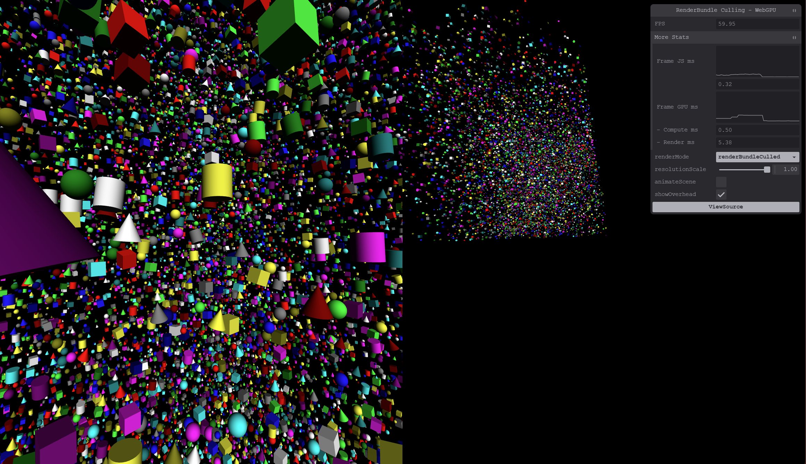

## Introduction

WebGPU offers a powerful new tool called [Render Bundles](https://gpuweb.github.io/gpuweb/#bundles) that can significantly reduce the amount of CPU time spent issuing repeated rendered commands, especially in the browser. At first glance they may seem to be fairly restrictive, but with the right techniques render bundles can be flexible enough to be used in many real-world scenarios, including more dynamic ones than you might expect!

This doc is focused on explaining how to best take advantage of render bundles, freeing up valuable CPU cycles in the process.

## Render Bundle overview

A render bundle can be thought of as a partial, reusable render pass. Once a render bundle has been encoded it can't be changed. This can initially make them feel appropriate only for static scenes, but with some clever tricks they can be used in a variety of scenarios, and in most cases they provide a significant reduction in CPU overhead.

The increased performance comes from render bundle's ability to bypass several parts of the typical command recording process when executed. Normally when you issue commands, like `setPipeline()` or `draw()`, in a render pass it'll go through something like the following:


The above steps are representative of using WebGPU in Chrome. For each command the high-level, handwavy process is:

 - First a command encoding call is made in the JavaScript virtual machine
 - This is marshalled into C++ which (after some prep work) sends it over the the GPU Process via our WebGPU wire protocol
 - The GPU process receives and decodes the commands
 - They're validated according to the WebGPU spec
 - If the command is valid it's translated into the equivalent commands for the platform's native API, like Vulkan, and communicated to the driver, which records them in a command buffer.
 - Work doesn't actually get dispatched to the GPU hardware until the command buffer is submitted.

Depending on the environment you use the steps may be different, but some are unavoidable, such as the validation and native API encoding steps.

When using a render bundle the same steps apply when initially encoding the render bundle, but when __executing__ the bundle as part of a render pass many of them can be skipped!


Here you can see that using a bundle allowed the same work to be dispatched to the hardware with far less CPU-side communication. This is because much of the validation and encoding was already performed at bundle encoding time and doesn't need to be repeated.

For applications that are **CPU bound**, meaning that they're having trouble feeding work to the GPU fast enough, render bundles can offer a valuable optimization tool. It's worth noting, however, that if a given WebGPU application is **GPU bound**, in that the main thing limiting it's performance is the GPU's fill rate or vertex processing speed, then using render bundles won't magically improve performance. They only reduce the CPU-side overhead of submitting commands.

Still, it's rarely a bad idea to reduce CPU usage, even if that's not the primary bottleneck in your app! It can improve battery life, allow more overhead for other CPU operations, and potentially expand the range of devices your app works well on! Using render bundles where you can will rarely be detrimental to your application's performance.

## Using Render Bundles

Consider the following code snippet that does some simple rendering each frame:

```js
function encodeRenderCommands(encoder) {
  // Set frame-wide state
  encoder.setPipeline(pipeline);
  encoder.setBindGroup(0, frameBindings);

  // Bind and draw object A
  encoder.setBindGroup(1, objectABindings);
  encoder.setVertexBuffer(0, objectAVertices);
  encoder.setIndexBuffer(objectAIndices, 'uint32');
  encoder.drawIndexed(32);

  // Bind and draw object B
  encoder.setBindGroup(1, objectBBindings);
  encoder.setVertexBuffer(0, objectBVertices);
  encoder.setIndexBuffer(objectBIndices, 'uint32');
  encoder.drawIndexed(64);
}

function onFrame() {
  const commandEncoder = device.createCommandEncoder();
  const passEncoder = commandEncoder.beginRenderPass({ /* Omitted for brevity */});

  encodeRenderCommands(passEncoder);

  passEncoder.end();
  device.queue.submit([commandEncoder.finish()]);
}
```

Because the same render commands are executed every time without changing, this is a good candidate for a render bundle! And fortunately very little has to change to make use of one. A `GPURenderBundleEncoder` needs to be created with some information about what types of render passes it will be compatible with in terms of color and depth attachment formats and sample counts. Then the render commands need to be executed on the bundle encoder rather than the pass encoder, at which point the encoder calls `finish()` which produces the `GPURenderBundle` itself. That can then be executed during the regular render pass.

```js
function encodeRenderCommands(encoder) {
  // Set frame-wide state
  encoder.setPipeline(pipeline);
  encoder.setBindGroup(0, frameBindings);

  // Bind and draw object A
  encoder.setBindGroup(1, objectABindings);
  encoder.setVertexBuffer(0, objectAVertices);
  encoder.setIndexBuffer(objectAIndices, 'uint32');
  encoder.drawIndexed(32);

  // Bind and draw object B
  encoder.setBindGroup(1, objectBBindings);
  encoder.setVertexBuffer(0, objectBVertices);
  encoder.setIndexBuffer(objectBIndices, 'uint32');
  encoder.drawIndexed(64);
}

// Create the render bundle
const bundleEncoder = device.createRenderBundleEncoder({
  colorFormats: ['bgra8unorm'],
  depthStencilFormat: 'depth24plus'
});
encodeRenderCommands(bundleEncoder);
const renderBundle = bundleEncoder.finish();

function onFrame() {
  const commandEncoder = device.createCommandEncoder();
  const passEncoder = commandEncoder.beginRenderPass({ /* Omitted for brevity */});

  // Execute the pre-recorded bundle
  passEncoder.executeBundles([renderBundle]);

  passEncoder.end();
  device.queue.submit([commandEncoder.finish()]);
}
```

Notice how the actual encoding of the render commands didn't need to change at all! This is because `GPURenderBundleEncoder` provide a subset of the functionality of a full `GPURenderPassEncoder`. Render bundles can do everything a render pass can do except:

 - Set the Viewport and Scissor bounds
 - Set the Blend Constant or Stencil Reference values
 - Perform occlusion queries
 - Execute other render bundles.

As a result in many cases you can use a `GPURenderPassEncoder` and a `GPURenderBundleEncoder` interchangeably for functions like our `encodeRenderCommands()` above and the code frequently won't need to know which one it's dealing with.

## Render Bundle state management

One thing to be careful about when using render bundles is that the render pass pipeline, bind group, and vertex/index buffer state is reset both before and after the bundle executes. This may seem a bit odd at first, but doing so allows the render bundle commands to be completely validated at creation time, which in turn allows the validation to be skipped when executing the bundle, improving performance.

This does lead to situations where best practices that may have been observed otherwise no longer apply. For example, normally you would try to limit the number of times that you re-bind the same bind group or pipeline, but if you are executing multiple render bundles that use the same state it's unavoidable. Looking back at our previous example, consider if we were to encode object A and object B each in their own bundle. You might initially try something like this:

```js
// WARNING! INVALID CODE!

// Create a render bundle for object A
let bundleEncoder = device.createRenderBundleEncoder({
  colorFormats: ['bgra8unorm'],
  depthStencilFormat: 'depth24plus'
});

// Set frame-wide state
encoder.setPipeline(pipeline);
encoder.setBindGroup(0, frameBindings);

// Bind and draw object A
encoder.setBindGroup(1, objectABindings);
encoder.setVertexBuffer(0, objectAVertices);
encoder.setIndexBuffer(objectAIndices, 'uint32');
encoder.drawIndexed(32);

const renderBundleA = bundleEncoder.finish();

// Create a render bundle for object B
bundleEncoder = device.createRenderBundleEncoder({
  colorFormats: ['bgra8unorm'],
  depthStencilFormat: 'depth24plus'
});

// Bind and draw object B
encoder.setBindGroup(1, objectBBindings);
encoder.setVertexBuffer(0, objectBVertices);
encoder.setIndexBuffer(objectBIndices, 'uint32');
encoder.drawIndexed(64);

const renderBundleB = bundleEncoder.finish();

function onFrame() {
  const commandEncoder = device.createCommandEncoder();
  const passEncoder = commandEncoder.beginRenderPass({ /* Omitted for brevity */});

  // Execute the pre-recorded bundles
  passEncoder.executeBundles([renderBundleA, renderBundleB]);

  passEncoder.end();
  device.queue.submit([commandEncoder.finish()]);
}
```

But this doesn't work! `renderBundleA` is valid and can draw as expected, but `renderBundleB` is invalid! Even though they were executed in sequence as part of the same pass, `renderBundleB` doesn't inherit the pipeline set in `renderBundleA`. In order to make this example work the "shared" state needs to be copied into each bundle.

```js
// Corrected code

// Create a render bundle for object A
let bundleEncoder = device.createRenderBundleEncoder({
  colorFormats: ['bgra8unorm'],
  depthStencilFormat: 'depth24plus'
});

// Set frame-wide state
encoder.setPipeline(pipeline);
encoder.setBindGroup(0, frameBindings);

// Bind and draw object A
encoder.setBindGroup(1, objectABindings);
encoder.setVertexBuffer(0, objectAVertices);
encoder.setIndexBuffer(objectAIndices, 'uint32');
encoder.drawIndexed(32);

const renderBundleA = bundleEncoder.finish();

// Create a render bundle for object B
bundleEncoder = device.createRenderBundleEncoder({
  colorFormats: ['bgra8unorm'],
  depthStencilFormat: 'depth24plus'
});

// UPDATED: Each render bundle needs to fully specify all of it's state.
// Set frame-wide state
encoder.setPipeline(pipeline);
encoder.setBindGroup(0, frameBindings);

// Bind and draw object B
encoder.setBindGroup(1, objectBBindings);
encoder.setVertexBuffer(0, objectBVertices);
encoder.setIndexBuffer(objectBIndices, 'uint32');
encoder.drawIndexed(64);

const renderBundleB = bundleEncoder.finish();

function onFrame() {
  const commandEncoder = device.createCommandEncoder();
  const passEncoder = commandEncoder.beginRenderPass({ /* Omitted for brevity */});

  // Execute the pre-recorded bundles
  passEncoder.executeBundles([renderBundleA, renderBundleB]);

  passEncoder.end();
  device.queue.submit([commandEncoder.finish()]);
}
```

This does lead to some repetition of state that wouldn't be necessary if the same calls were made outside of a render bundle. But keep in mind that those calls will generally be less expensive because they're in a render bundle.

## Render Bundles scope guidelines

Because of the above mentioned requirements that render bundles contain all the state setting needed for the draw calls they execute, the general guideline is that you want to include as many draw calls in your render bundles as is practical. If your entire scene can be rendered with one big render bundle, then great! Do that!

Keep in mind, however, that render bundles are only really effective if they can be executed more than once. If you find yourself in a situation where you are rebuilding your render bundles on a per-frame basis to accommodate new or updated draw calls then you may be better off simply doing the draws directly.

Similarly, there's some types of WebGPU content that actively requires frequent changes to the resources used, such as [External Textures](https://gpuweb.github.io/gpuweb/#gpuexternaltexture). Created from video streams, these textures expire once the video decoding has prepared the next frame, requiring a new external texture to be created to capture the new video frame, and a new bind group created to bind it. That means that any render bundle that includes an external texture is likely to be made invalid by the texture expiring within a frame or two of it's creation. As a result it's generally not advised to use render bundles and External Textures together.

An exception would be if you know that the same content will be rendered more than once in a single frame, such as when rendering the left and right views for a virtual reality application. In that case the savings from skipping the encoding and validation for the repeated draws will almost always be worth it, even if the content being drawn is changing on a nearly per-frame basis.

Fortunately, render bundles are not an all-or-nothing concept! You can easily mix more stable content drawn with a render bundle with frequently changing content that is encoded dynamically every frame. Or mix-and-match several render bundles, as needed for the scene. For example, you may have one large render bundle that draws most of the static elements of a scene, several smaller ones that each draw a single complex character, and a few non-bundled draws for a video embedded in the scene. It's entirely up to you based on the needs of your content.

## Aside: Why aren't there Compute Bundles?

You might notice that any mention of compute work is conspicuously absent from all of this bundle talk. And that's because there's no compute bundles in WebGPU! Why is that?

Well, primarily it's due to the fact that while render bundles have equivalent native APIs that can be used to implement them, bundling of compute operations doesn't have the same native support. Besides that, though, we just don't generally expect that compute operations will need it to the same degree that render operations do. Rendering can easily involve hundreds or thousands of draw calls per frame, which typically requires a lot of state setting. In contrast, it's common for an application's compute work to consist of a few big jobs with less state, which are easier to set up and dispatch overall.

That's not going to hold true for everything, of course, and if the WebGPU working group sees that the CPU overhead of dispatching compute work is becoming a bottleneck for developers then there's a good chance that compute bundles will be considered.

## Dynamic Content in Render Bundles

Because render bundles execute an immutable set of commands once recorded, your first impulse might be to assume they are only useful for static content, and even then they may be difficult to utilize if you want to use optimizations like frustum culling. Fortunately, content drawn with render bundles can be more dynamic than you might expect!

### Resource Updates

The most important thing to realize is that the __commands__ executed by render bundles are static, but the __resources__ used by them don't have to be! The most basic example of this is updating the scene's viewpoint. Almost any WebGPU rendering will make use of some form of "camera" information, often given as various combinations of projection, view, and model matrices. Because they frequently change on a per-frame basis, it makes sense to expose them to the render pipelines as values in a uniform or storage buffer. As a result, you can encode the rendering for a given scene into a render bundle but still move the viewpoint around by updating the values in the buffer.

This is because the render bundle doesn't create snapshots of any of the resources that are bound during it's encoding, it simply re-binds the same buffers and textures the next time it's executed. As such if you have a view matrix in a buffer you can update it between every execution of the render bundle and it will draw from that new viewpoint each time.

It follows, then, that ANY content that uses a buffer or texture has the potential to be dynamically updated without re-encoding the render bundle. Meshes can be moved around the scene by updating their model matrices. Updating textures between frames can be used to display animated images. Vertex buffers can be re-populated to produce dynamic surfaces or particle effects, and skeletal data can be manipulated for GPU skinning. Since so much of what's rendered depends on the resources being bound, it's easy to see how render bundles can still be used for very dynamic scenes.

### Indirect Draws

Being able to move and manipulate so many elements of the scene is powerful, but there's times where the draw calls themselves need to be updated to accommodate the desired effect. Consider, for example, particle effects. It's not unusual to have the number of particles change over the lifetime of the effect as new particle as spawned and existing particles expire. Since we can't alter the calls made in a render bundle this would seem to exclude something like particle effects from being included in the bundle, right?

No! Fortunately for us WebGPU includes a feature known as "indirect drawing". Executed with the `drawIndirect()` and `drawIndexedIndirect()` commands, indirect draws function exactly like a normal draw call but with the critical difference that the arguments for the call are read from a buffer instead of being passed directly.

That means that this draw call:

```js
renderPass.draw(vertexCount, instanceCount);
```

Is identical to this one:

```js
const drawBuffer = device.createBuffer({
  size: 16,
  usage: GPUBufferUsage.INDIRECT | GPUBufferUsage.COPY_DST
});
const drawArgs = new Uint32Array(4);
drawArgs[0] = vertexCount;
drawArgs[1] = instanceCount;
drawArgs[2] = 0; // First Vertex
drawArgs[3] = 0; // First Instance
device.queue.writeBuffer(drawBuffer, 0, drawArgs);

renderPass.drawIndirect(drawBuffer, 0 /* drawBuffer Offset */);
```

Obviously the second code snippet is more complex, even in this super simplified case. So why would you ever prefer it over a standard draw call?

The most common reason is that you want to define the draw call parameters in a compute shader rather than on the CPU side. Going back to the particle example, if the particle behavior was being driven by a compute shader then the same shader could write out the number of particles to be drawn to the vertex or instance count of the indirect buffer. If indirect draws weren't available you would have to do a slow readback of the particle count to the CPU, by which point it would likely be one or more frames behind. Or you'd always draw the maximum number of particles but in the compute shader do some trick to hide the ones that shouldn't be shown, such as moving them to a distant spot or collapsing their vertices into a single degenerate point, which just wastes vertex processing time. Indirect draws keep everything on the GPU and allow you to only do the necessary amount of work for dynamic draws.

As you've probably guessed, since the indirect draw buffers are, well, buffers, they play nicely with render bundles. While the bindings and number of draw calls in a bundle will always be locked to what was originally encoded, if indirect draws are used the amount of geometry and the number of instances drawn by those calls can be dynamic. It makes it practical to include rendering things like particle systems in a render bundle without unnecessary overhead.

> **Update:** If you are using indirect draws in your app, be sure to check out my article on [Indirect draw call best practices](./indirect-draws)!

### Object Culling

That leads us to one of the most common concerns I've heard of when talking about render bundles: They don't seem to be compatible with common rendering optimizations such as frustum and occlusion culling. Happily for us, that's not the case! **Culling algorithms CAN be used with render bundles** by making use of indirect draws to keep visiblity testing results entirely on the GPU.

The methods for doing so are not unique to WebGPU, and you can read more about implementations of the technique in [Vulkan](https://vkguide.dev/docs/gpudriven/compute_culling/) or [D3D12](https://learn.microsoft.com/en-us/windows/win32/direct3d12/indirect-drawing-and-gpu-culling-) to get an in depth sense of how it works. The high-level summary is this:

  - Create buffers with instance data (probably at least a transform matrix and size) of every cullable object.
  - Every frame run compute shaders that tests each instance for visibility.
  - If the instance is visible:
    - Add the index of the instance data to an array of visible instances
    - Increment the number of instances to draw in the indirect draw buffer for that object by one
  - Draw any cullable objects with indirect draw calls, using the indirect buffers populated in the previous shader
  - In the render pipeline, use the built-in instance index with the visible instance array to look up the actual instance data and render with that.

This is a great technique to reduce render times even without render bundles, but the fact that it can be used with render bundles makes it even better! The result is that at draw time you're still going to call draw at least once for every object type, but the number of instances of that object and which instances are drawn will be determined by the visibility test in the compute shader.

I've built [a simple demo that demonstrates this technique with WebGPU](https://toji.github.io/webgpu-bundle-culling). In it you can switch between a naive draw loop (one draw call per instance), an instanced draw loop (one draw call per unique object type), and a draw loop using the GPU culling algorithm described above, as well as versions of all of the above that use render bundles.
[](https://toji.github.io/webgpu-bundle-culling)

Results will vary depending on your device, but I find that on many of the devices that I tested using the GPU culling path makes the difference between the scene running smoothly or being a choppy mess.

#### GPU Culling Caveats

There's a few considerations to keep in mind when using this algorithm. Because we don't change the number of draw calls if every instance of a particular object is culled it will result in 0 instances of the object being drawn. That's unfortunate, because it means that all of the resource binding done for that object went to waste, but the GPU won't process any of the vertices in that case. So as long as it's not excessive having a few empty draw calls here and there is worth it for the overall reduction in rendering overhead.

Still, the more instances of a particular object there are, the more effective this technique is. While it works even if there's only one instance of a given object in the scene, the chances of hitting that "draw 0 instances" edge case is a lot higher in that situation. If that singleton object is relatively complex, such as a very detailed, skinned character with multiple complex materials, then it may be worthwhile to handle its culling in a different manner. (Such as placing it in it's own separate render bundle and doing the visibility check on the CPU.)

## Wrap up

Hopefully this document has helped demystify WebGPU's render bundles and the variety of situations they can be used in. Many aspects of WebGPU were designed to reduce the overall CPU time required for typical rendering, and render bundles are the most powerful example of that. They were designed after listening to the feedback of many developers experiences struggling to streamline their WebGL rendering over the years, and we hope that the WebGPU development community embraces them to push their rendering to new heights!
