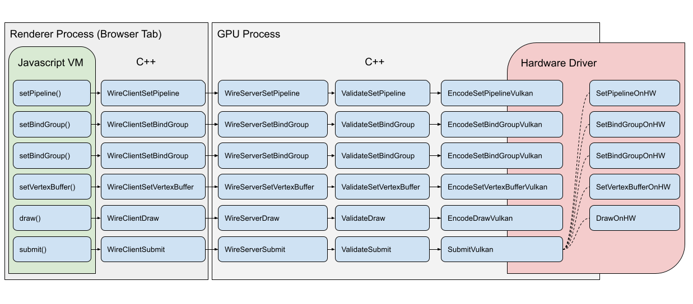
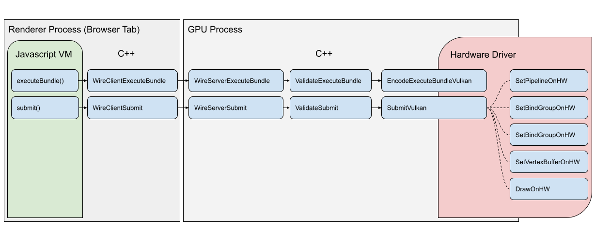

# FIXME: Remove before publishing!
 Investigation: https://github.com/gpuweb/gpuweb/issues/286
 Vulkan - Secondary Command Buffers: https://registry.khronos.org/vulkan/specs/1.1-extensions/html/vkspec.html#commandbuffers-secondary
 D3D12 - Bundles: https://learn.microsoft.com/en-us/windows/win32/direct3d12/recording-command-lists-and-bundles
 Metal - https://developer.apple.com/documentation/metal/indirect_command_encoding/encoding_indirect_command_buffers_on_the_cpu


Potential use cases:
 - Largely static scenes (w/o culling)
 - Game HUD


Notes:
 - Greater impact in browser than in native environment
 - Small-ish bundles are OK!
 -

## Introduction

WebGPU offers a powerful new tool called [Render Bundles](https://gpuweb.github.io/gpuweb/#bundles) that can significantly reduce the amount of CPU time spent issuing repeated rendered commands, especially in the browser. At first glance they may seem to be fairly restrictive, but with the right techniques render bundles can be flexible enough to be used in many real-world scenarios, including more dynamic ones than you might expect!

This doc is focused on explaining how to best take advantage of render bundles, freeing up valuable CPU cycles in the process!

## Render Bundle overview

A render bundle is can be thought of as a partial, reusable render pass. Once a render bundle has been encoded it can't be changed. This can initially make it feel appropriate only for largely static scenes, but with some clever tricks they can be used in a variety of scenarios, and in most cases they provide a significant reduction in CPU overhead.

The increased performance comes from render bundle's ability to bypass several parts of the typical command recording process when executed. Normally when you issue commands, like `setPipeline()` or `draw()`, in a render pass it'll go through the following steps:


The above steps are representative of using WebGPU in Chrome. For each command the high-level, handwavy process is:

 - First a command encoding call is made in the JavaScript Virtual Machine
 - This is mashalled into C++ which (after some prep work) sends it over the the GPU Process via our WebGPU wire protocol
 - The GPU process receives and decodes the commands
 - They're validated according to the WebGPU spec
 - If the command is valid it's translated into the equivalent commands for the platform's native API, like Vulkan, and communicated to the driver, which records them in a command buffer.
 - Work doesn't actually get dispatched to the GPU hardware until the command buffer is submitted.

Depending on the environment you use the steps may be different, but some are unavoidable, such as the validation and native API encoding steps.

When using a render bundle the same steps apply when initially encoding the render bundle, but when __executing__ the bundle as part of a render pass many of them can be skipped!


Here you can see that using a bundle allowed the same work to be dispatched to the hardware with far less CPU-side communication. This is because much of the validation and encoding was already performed at bundle encoding time and doesn't need to be repeated.

For applications that are **CPU bound**, meaning that they're having trouble feeding work to the GPU fast enough, render bundles can offer a valuable optimization tool. It's worth noting, however, that if a given WebGPU application is **GPU bound**, in that the main thing limiting it's performance is the GPU's fill rate or vertex processing speed, then using render bundles won't magically improve performance. They only reduce the CPU-side overhead of submitting commands.

## Using Render Bundles

Consider the following code snippet that does some simple rendering each frame:

```js
function encodeRenderCommands(encoder) {
  // Set frame-wide state
  encoder.setPipeline(pipeline);
  encoder.setBindGroup(0, frameBindings);

  // Bind and draw object A
  encoder.setBindGroup(1, objectABindings);
  encoder.setVertexBuffer(0, objectAVertices);
  encoder.setIndexBuffer(objectAIndices, 'uint32');
  encoder.drawIndexed(32);

  // Bind and draw object B
  encoder.setBindGroup(1, objectBBindings);
  encoder.setVertexBuffer(0, objectBVertices);
  encoder.setIndexBuffer(objectBIndices, 'uint32');
  encoder.drawIndexed(64);
}

function onFrame() {
  const commandEncoder = device.createCommandEncoder();
  const passEncoder = commandEncoder.beginRenderPass({ /* Ommitted for brevity */});

  encodeRenderCommands(passEncoder);

  passEncoder.end();
  device.queue.submit([commandEncoder.finish()]);
}
```

Because the same render commands are executed every time without changing, this is a good candidate for a render bundle! And fortunately very little has to change to make use of one. A `GPURenderBundleEncoder` needs to be created with some information about what types of render passes it will be compatible with in terms of color and depth attachment formats and sample counts. Then the render commands need to be executed on the bundle encoder rather than the pass encoder, at which point the encoder calls `finish()` which produces the `GPURenderBundle` itself. That can then be executed during the regular render pass.

```js
function encodeRenderCommands(encoder) {
  // Set frame-wide state
  encoder.setPipeline(pipeline);
  encoder.setBindGroup(0, frameBindings);

  // Bind and draw object A
  encoder.setBindGroup(1, objectABindings);
  encoder.setVertexBuffer(0, objectAVertices);
  encoder.setIndexBuffer(objectAIndices, 'uint32');
  encoder.drawIndexed(32);

  // Bind and draw object B
  encoder.setBindGroup(1, objectBBindings);
  encoder.setVertexBuffer(0, objectBVertices);
  encoder.setIndexBuffer(objectBIndices, 'uint32');
  encoder.drawIndexed(64);
}

// Create the render bundle
const bundleEncoder = device.createRenderBundleEncoder({
  colorFormats: ['bgra8unorm'],
  depthStencilFormat: 'depth24plus'
});
encodeRenderCommands(bundleEncoder);
const renderBundle = bundleEncoder.finish();

function onFrame() {
  const commandEncoder = device.createCommandEncoder();
  const passEncoder = commandEncoder.beginRenderPass({ /* Ommitted for brevity */});

  // Execute the pre-recorded bundle
  passEncoder.executeBundles([renderBundle]);

  passEncoder.end();
  device.queue.submit([commandEncoder.finish()]);
}
```

Notice how the actual encoding of the render commands didn't need to change at all! This is because `GPURenderBundleEncoder` provide a subset of the functionality of a full `GPURenderPassEncoder`. Render bundles can do everything a render pass can do except:

 - Set the Viewport and Scissor bounds
 - Set the Blend Constant or Stencil Reference values
 - Perform occlusion queries
 - Execute other render bundles.

As a result in many cases you can use a `GPURenderPassEncoder` and a `GPURenderBundleEncoder` interchangably for functions like our `encodeRenderCommands()` above and the code frequently won't need to know which one it's dealing with.

## Render Bundle state management

One thing to be careful about when using render bundles is that the render pass pipeline, bind group, and vertex/index buffer state is reset both before and after the bundle executes. This may seem a bit odd at first, but doing so allows the render bundle commands to be completely validated at creation time, which in turn allows the validation to be skipped when executing the bundle, improving performance.

This does lead to situations where best practices that may have been observed otherwise no longer apply. For example, normally you would try to limit the number of times that you re-bind the same bind group or pipeline, but if you are executing multiple render bundles that use the same state it's unavoidable. Looking back at our previous example, consider if we were to encode object A and object B each in their own bundle. You might initially try something like this:

```js
// WARNING! INVALID CODE!

// Create a render bundle for object A
let bundleEncoder = device.createRenderBundleEncoder({
  colorFormats: ['bgra8unorm'],
  depthStencilFormat: 'depth24plus'
});

// Set frame-wide state
encoder.setPipeline(pipeline);
encoder.setBindGroup(0, frameBindings);

// Bind and draw object A
encoder.setBindGroup(1, objectABindings);
encoder.setVertexBuffer(0, objectAVertices);
encoder.setIndexBuffer(objectAIndices, 'uint32');
encoder.drawIndexed(32);

const renderBundleA = bundleEncoder.finish();

// Create a render bundle for object B
bundleEncoder = device.createRenderBundleEncoder({
  colorFormats: ['bgra8unorm'],
  depthStencilFormat: 'depth24plus'
});

// Bind and draw object B
encoder.setBindGroup(1, objectBBindings);
encoder.setVertexBuffer(0, objectBVertices);
encoder.setIndexBuffer(objectBIndices, 'uint32');
encoder.drawIndexed(64);

const renderBundleB = bundleEncoder.finish();

function onFrame() {
  const commandEncoder = device.createCommandEncoder();
  const passEncoder = commandEncoder.beginRenderPass({ /* Ommitted for brevity */});

  // Execute the pre-recorded bundles
  passEncoder.executeBundles([renderBundleA, renderBundleB]);

  passEncoder.end();
  device.queue.submit([commandEncoder.finish()]);
}
```

But this doesn't work! `renderBundleA` is valid and can draw as expected, but `renderBundleB` is invalid! Even though they were executed in sequence as part of the same pass, `renderBundleB` doesn't inherit the pipeline set in `renderBundleA`. In order to make this example work the "shared" state needs to be copied into each bundle.

```js
// Corrected code

// Create a render bundle for object A
let bundleEncoder = device.createRenderBundleEncoder({
  colorFormats: ['bgra8unorm'],
  depthStencilFormat: 'depth24plus'
});

// Set frame-wide state
encoder.setPipeline(pipeline);
encoder.setBindGroup(0, frameBindings);

// Bind and draw object A
encoder.setBindGroup(1, objectABindings);
encoder.setVertexBuffer(0, objectAVertices);
encoder.setIndexBuffer(objectAIndices, 'uint32');
encoder.drawIndexed(32);

const renderBundleA = bundleEncoder.finish();

// Create a render bundle for object B
bundleEncoder = device.createRenderBundleEncoder({
  colorFormats: ['bgra8unorm'],
  depthStencilFormat: 'depth24plus'
});

// UPDATED: Each render bundle needs to fully specify all of it's state.
// Set frame-wide state
encoder.setPipeline(pipeline);
encoder.setBindGroup(0, frameBindings);

// Bind and draw object B
encoder.setBindGroup(1, objectBBindings);
encoder.setVertexBuffer(0, objectBVertices);
encoder.setIndexBuffer(objectBIndices, 'uint32');
encoder.drawIndexed(64);

const renderBundleB = bundleEncoder.finish();

function onFrame() {
  const commandEncoder = device.createCommandEncoder();
  const passEncoder = commandEncoder.beginRenderPass({ /* Ommitted for brevity */});

  // Execute the pre-recorded bundles
  passEncoder.executeBundles([renderBundleA, renderBundleB]);

  passEncoder.end();
  device.queue.submit([commandEncoder.finish()]);
}
```

This does lead to some repetition of state that wouldn't be necessary if the same calls were made outside of a render bundle. But keep in mind that those calls will generally be less expensive because they're in a render bundle.