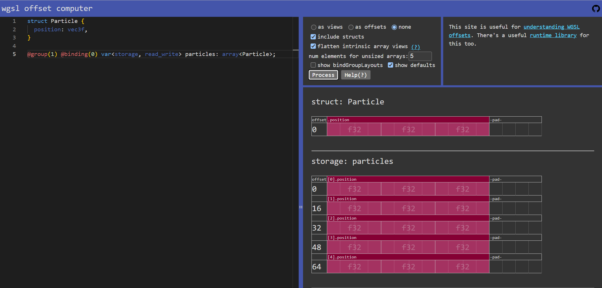

<link rel="stylesheet" href="../particles.css">
<script src='../embedded-demos.js'></script>

This section is going to be pretty heavy on basic setup of some of the necessary resources, which isn't very exciting, but it'll give us a good starting point to layer more interesting features onto!

## Initializing Particles
As a first step, we're only going to initialize a set of particles to some easy-to-verify state.

The first task will be figuring out how to store our particles. We already mentioned that in the past GPU-driven particle systems were largely designed to be stored in textures. We could still do that here, but really buffers are a better fit if we want flexibility. WebGPU buffers can be used for a variety of things, such as vertices, indices, or uniforms, but if you want to write to a buffer from a shader (and we do) you need to use what's known as a "storage" buffer.

Using a storage buffer will allow us to lay out in shader code both the structure of each particle and declare a readable/writeable array of them. The struct should contain every value that is needed to represent a single particle, like position, velocity, color, etc. Though for the moment we can just start with the bare minimum, a position:

```rs
// WGSL shader
struct Particle {
  position: vec3f,
}

@group(1) @binding(0) var<storage, read_write> particles: array<Particle>;
```

> **Note:** Because `position` is the only member we just as easily could have declared the storage binding as an `array<vec3f>`, but we can also predict that we'll be expanding that in the very near future so it makes sense to use a struct from the very beginning.

To create the buffer needed to bind to that array, we need to know how big it should be. At minimum it needs to be the size in bytes of a single particle times the maximum number of particles we want our system to handle. For our max particle count We can just pick an arbitrary number, like 1000. (We're starting small.) The size of the particle struct can be trickier, and requires you to know the [alignment and size rules](https://www.w3.org/TR/WGSL/#alignment-and-size) used by WGSL. For example a `vec3f` in WGSL takes 12 bytes (4 bytes per `f32` * 3) but must align on 16 byte boundaries. So the array will need **16 bytes per particle** even though the only member is technically 12 bytes in size.

If this kind of size calculation sounds confusing, then I highly recommend making use of [WebGPU Fundamentals' Offset Computer](https://webgpufundamentals.org/webgpu/lessons/resources/wgsl-offset-computer.html#x=5d00000100f200000000000000003d888b0237284d3025f2381bcb288a12586e1dfe1d0334d1445ee31ad5803c7e94d7c23387ff226438a6b544e8abab884002cb4bbaa4861f05ecebc7592f2c0b63b1f3615d836981b1de7edf9b1feec3b6a8c75c6d618cea38f947fc8a49859041e05233a5360f58edd3f20c285745a052f789d3731497c85b60f88ddcdf8f9b1b74d7ab8000f6dae6f7cdb4bab5315664adb2ec2bcbe70e92d03013a6c16100d9df9bedb16318e624845b535346a4fef97c65), which lets you plug in your own struct and see an easy-to-understand visualization of how the values are laid out by WGSL. This is how it visualizes our simple particle struct:



Or, a more complex example from later on in this article:


Now that we know the number of particles we're tracking and the size of each we can create an appropriate buffer to hold them:

```ts
// We'll use these values in a couple of places, so it's useful to delare them as constants.
const MAX_PARTICLE_COUNT = 1000;
const BYTES_PER_PARTICLE = 16;

class ParticleDemo {
  particleBuffer: GPUBuffer;

  onInit(device: GPUDevice) {
    this.particleBuffer = device.createBuffer({
      // Enough room to store 1000 particles
      size: MAX_PARTICLE_COUNT * BYTES_PER_PARTICLE,
      // STORAGE usage for the compute binding
      usage: GPUBufferUsage.STORAGE,
    });
  }
}
```

We can also build a corresponding Bind Group Layout and Bind Group to expose the resources we need (for now just the particle buffer) to a compute shader.

> **Note:** If you're not familiar with Bind Groups and Bind Group Layouts yet, or simply want to understand better why they're set up the way they are, check out my [Bind Group best practices article](../../webgpu-best-practices/bind-groups).

```ts
// In onInit(), after creating particleBuffer...
const particleComputeBindGroupLayout = device.createBindGroupLayout({
  label: 'Particle Compute',
  entries: [{
    binding: 0,
    visibility: GPUShaderStage.COMPUTE,
    buffer: { type: 'storage' }
  }]
});

this.particleComputeBindGroup = device.createBindGroup({
  label: 'Particle Compute',
  layout: particleComputeBindGroupLayout,
  entries: [{
    binding: 0,
    resource: { buffer: this.particleBuffer }
  }]
});
```

A word of caution: This is an area where it might feel like it would be OK to use `layout: 'auto'` when creating the compute pipeline in an upcoming step instead of manually building out the Bind Group Layout here, which can feel like a chore. Don't do it! In future revisions of the code we'll want to share this bind group between multiple compute shaders, and the only way to do that is with an explicit layout.

And now we can consider how to initialize the particle buffer contents. When that buffer is created it will automatically be filled with zeros, which means if we tried to render our "particles" at this point they'd all be in the same spot: at the origin. That's not terribly interesting, so lets initialize them with some better values. A really straightfoward starting point would be to organize the particles into a 10x10x10 grid. That way you'll be able to tell very quickly if your particle data is what you expect it to be just by glancing at the rendered output.

FIXME

```rs
// WGSL shader
override workgroupSize: u32;
override maxParticleCount: u32;

struct Particle {
  position: vec3f,
}

@group(1) @binding(0) var<storage, read_write> particles: array<Particle>;

@compute @workgroup_size(workgroupSize)
fn particleInit(@builtin(global_invocation_id) globalId : vec3u) {
  let id = globalId.x;
  if (id >= maxParticleCount) { return; }

  particles[id].position = vec3f(
    f32(id % 10) - 4.5,
    f32((id % 100) / 10) - 4.5,
    f32(id / 100) - 4.5
  );
}
```

> **Note:** We _could_ initialize the particle buffer values from JavaScript, setting the appropriate coordinates into an `ArrayBuffer` that's the same size (in bytes) as the particle buffer and copying it to the buffer's GPU memory with `device.queue.writeBuffer()`. In fact, in some cases that might be the best approach! For example: If you want a very specific initialization data for all of your particles that's read from a file. But in most cases where the particle's initial state can be easily computed, a compute shader is probably more efficient.

Next we want to create the compute pipeline using the layout and shader we created above. Because I'm using override contants without defaults in the shader above I need to populate them here using the JavaScript constants I've been declaring at the top of my source file. This provides a really clean way of keeping the constants synced up between WGSL and JavaScript.

```ts
// In onInit()
const module = device.createShaderModule({
  code: PARTICLE_SHADER,
});

this.particleInitPipeline = device.createComputePipeline({
  label: 'Particle Init',
  layout: device.createPipelineLayout({ bindGroupLayouts: [
    particleComputeBindGroupLayout
  ]}),
  compute: {
    module,
    entryPoint: 'particleInit',
    constants: {
      workgroupSize: PARTICLE_WORKGROUP_SIZE,
      maxParticleCount: MAX_PARTICLE_COUNT,
    }
  }
});
```

> **Note:** Alternatively you could use JavaScript's [Template Literals](https://developer.mozilla.org/en-US/docs/Web/JavaScript/Reference/Template_literals) to inject the constant values directly into the shader source. Read more about these types of WGSL shader building techniques in my [Dynamic Shader Construction article](https://toji.dev/webgpu-best-practices/dynamic-shader-construction).

Once we have the pipeline, we'll want to dispatch it once at the end of our `onInit()` method to initialize the buffer data. I find it clearer to move those calls into their own function, like so:

```ts
// Call at the end of onInit()
initParticles(device: GPUDevice) {
  const commandEncoder = device.createCommandEncoder();

  const computePass = commandEncoder.beginComputePass();

    computePass.setBindGroup(0, this.particleComputeBindGroup);
    computePass.setPipeline(this.particleInitPipeline);

    const workgroupCount = Math.ceil(MAX_PARTICLE_COUNT / PARTICLE_WORKGROUP_SIZE);
    computePass.dispatchWorkgroups(workgroupCount);

  computePass.end();

  device.queue.submit([commandEncoder.finish()]);
}
```

The most important thing to pay attention to here is the calculation of `workgroupCount`. `dispatchWorkgroups()` takes the number of _workgroups_ that will be executed, **not** the number of total invocations of the shader. Remember that our workgroup size is 64, so each workgroup we dispatch will process 64 particles. And we need to dispatch _at least_ enough workgroups to cover every particle in the buffer. But since 1000 isn't evenly divisible by 64, we have to round up to ensure that we don't miss some of the particles at the end of the buffer. Hence the use of `Math.ceil()`.

Once that command buffer has been submitted the compute shader will spin through every particle in the buffer and set it's poition. So now we should have a buffer full of particle positions laid out in a big grid!

## Simple rendering

To prove that the compute shader above is working, let's put together a render pipeline that can draw the particles for us in a simplistic fashion. We'll start by drawing them as simple white squares, and then we can improve it from

The vertex and fragment methods can be written in separate shader modules if you want, but I find it easiest (at least at this stage) to write them in the same string as the compute shaders. One big benefit of doing that is that you can share the same `Particle` structure between the compute and rendering side of things rather than trying to keep them synced up between two separate shader modules. It ends up looking something that looks like this:

```rs
struct Particle {
  position: vec3f,
}

// Compute

/*
 * Some compute stuff omitted for clarity
 */
@compute @workgroup_size(/* ... */)
fn particleInit() {
  /* ... */
}

// Rendering

@vertex
fn particleVertex() -> @builtin(position) vec4f {
  // TODO
}

@fragment
fn particleFragment() -> @location(0) vec4f {
  // TODO
}
```

This works because we tell the compute and render pipelines the `entryPoint` name every time we specify a shader stage.

For the vertex shader, we don't need a complex mesh for each particle, a simple square will do. And because it's so simple we don't need to pass any vertex attributes in via a vertex buffer, we can encode the positions directly into the shader text! Then in the vertex shader we can use the [`vertex_index` built-in](https://gpuweb.github.io/gpuweb/wgsl/#vertex-index-builtin-value) to tell us which vertex number we're processing and look it up from our embedded array:

```rs
// 2D vertex positions for a small (0.2 units per side) square around the origin.
// We can worry about adjusting the size later.
var<private> particleVerts = array<vec2f, 4>(
  vec2f(-0.1, -0.1),
  vec2f(0.1, -0.1),
  vec2f(-0.1, 0.1),
  vec2f(0.1, 0.1),
);

// Let's assume that any camera uniforms you need are bound to group 0:
@group(0) @binding(0) var<uniform> camera: CameraUniforms;

@vertex
fn particleVertex(@builtin(vertex_index) vertexId: u32) -> @builtin(position) vec4f {
  // Use the vertexId to look up the particle vertex we're processing.
  let vertexPos = particleVerts[vertexId];

  // Transform the vertex by the camera view and projection matrices.
  return camera.projection * camera.view * vec4f(particlePos, 0, 1);
}
```

Of course that doesn't take into account the actual particle position at all, so every square we render would show up at the origin. To render the square at the particle position we need to pull the positions from the buffer that we populated earlier.

There's a couple of ways that you can do that. With older APIs the traditional method would have been to bind the particle buffer as a vertex buffer that uses [`stepMode: 'instance'`](https://gpuweb.github.io/gpuweb/#enumdef-gpuvertexstepmode). Then the particle position would be fed to the vertex shader like any normal vertex attribute. It would require adding `GPUBufferUsage.VERTEX` to the particle buffer's `usage` and setting up a vertex layout when creating the render pipeline.

That would work fine for now, especially when the particle data is so simple, but as our particle system gets more complex in the future it will become harder to keep the shader struct and the vertex layout in sync, not to mention that it would require you to effectively duplicate the `Particle` struct in the shader code.

A more elegant approach is to simply read the particle values directly from the particle storage buffer using the [`instance_index` built-in](https://gpuweb.github.io/gpuweb/wgsl/#instance-index-builtin-value) to determine which particle we're processing. This keeps our method of accessing the particle information consistent between the compute and rendering portions of the shader.

There's a catch, though: vertex shaders can't write to storage buffers, only read from them. This means that even though it'll be accessing the same buffer, we have to add a new binding to the shader for the particle buffer with `read` access instead of `read_write`. I'll call it `renderParticles` to differentiate it from the writable `particles` used by the compute shader.

Once we have access to that all we have to do is offset the vertex position by the particle position for the given instance that we're rendering:

```rs
@group(1) @binding(0) var<storage, read> renderParticles: array<Particle>;

@vertex
fn particleVertex(@builtin(vertex_index) vertexId: u32, @builtin(instance_index) id: u32) -> @builtin(position) vec4f {
  // Getting a pointer to the particle at the given id will make it easier to reference in the future
  let particle: ptr<storage, Particle> = &renderParticles[id];

  let vertexPos = particleVerts[vertexId];
  // Add the particle position to the vertex position.
  let particlePos = vec3f(vertexPos, 0) + particle.position;

  return camera.projection * camera.view * vec4f(particlePos, 1);
}
```

The fragment shader is ridiculously simple for the moment. All we need to do is return a flat color:

```rs
@fragment
fn particleFragment() -> @location(0) vec4f {
  // Return white.
  return vec4f(1, 1, 1, 1);
}
```

That wraps us the shaders, but we still have to set up the render pipeline and bind groups.

First, create a new bind group layout and bind group for the render bindings. At the moment this looks almost identical to the compute layout and bind group, but the `visibility` is `GPUShaderStage.VERTEX | GPUShaderStage.FRAGMENT` instead of `GPUShaderStage.COMPUTE` and the buffer type is `'read-only-storage'` instead of `'storage'` in order to satisfy WebGPU's requirement that storage buffers can't be modified in a vertex shader.

```ts
// In onInit()

const particleRenderBindGroupLayout = device.createBindGroupLayout({
  label: 'Particle Render',
  entries: [{
    binding: 0,
    visibility: GPUShaderStage.VERTEX | GPUShaderStage.FRAGMENT,
    buffer: { type: 'read-only-storage' }
  }]
});

this.particleRenderBindGroup = device.createBindGroup({
  label: 'Particle Render',
  layout: particleRenderBindGroupLayout,
  entries: [{
    binding: 0,
    resource: { buffer: this.particleBuffer }
  }]
});
```

The render pipeline is more complex (they always are) but not surprising if you've done any other rendering with WebGPU. The most important bit for now is that we want to use the [`'triangle-strip'` topology](https://gpuweb.github.io/gpuweb/#enumdef-gpuprimitivetopology) so that the 4 vertices we defined earlier make a complete quad, instead of requiring that we define 6 verticies or use an index buffer.

```ts
// In onInit()

this.particleRenderPipeline = device.createRenderPipeline({
  label: 'Particle Render',
  layout: device.createPipelineLayout({ bindGroupLayouts: [
    cameraBindGroupLayout, // Again, we assume there's a bind group layout for the camera uniforms.
    particleRenderBindGroupLayout
  ]}),
  vertex: {
    module,
    entryPoint: 'particleVertex',
  },
  primitive: {
    topology: 'triangle-strip'
  },
  depthStencil: {
    format: this.depthFormat,
    depthWriteEnabled: true,
    depthCompare: 'less-equal',
  },
  fragment: {
    module,
    entryPoint: 'particleFragment',
    targets: [{
      format: this.colorFormat,
    }]
  }
});
```

And now that we have our render pipeline and bind group ready we can finally do some rendering! Nothing fancy here, just setting the bind groups and render pipeline, then drawing 4 vertices (to match the 4 positions we defined in the shader) with an instance count that matches the number of particles in our buffer.

```ts
onFrame() {
  const commandEncoder = device.createCommandEncoder();

  const renderPass = commandEncoder.beginRenderPass({/* ... */});

    // And again, we're assuming there's a bind group with the camera uniforms available.
    renderPass.setBindGroup(0, this.cameraBindGroup);
    renderPass.setBindGroup(1, this.particleRenderBindGroup);
    renderPass.setPipeline(this.particleRenderPipeline);
    renderPass.draw(4, MAX_PARTICLE_COUNT);

  renderPass.end();

  device.queue.submit([commandEncoder.finish()]);
}
```

If done correctly you can expect to see a grid of white squares, like so:

<a class='demo-link' href='https://toji.github.io/webgpu-particles/1.html'>
  
</a>

As you can see, this isn't particularly attractive but it _does_ demonstrate that we are able to place the particles where we want in the compute shader and then render them. Plus we did it without the particle data ever touching the CPU! So it's a good start.

## Textured billboards
While there may be some visual styles where flat shaded quads as particles may fit well, most particle systems you see render their particles as **textured billboards** to achieve the effect that they want. "Billboard" in this case means a quad that is always rotated so that it faces towards the camera. (Enemies in the original Doom were billboards, for example.) By billboarding our particles we can better hide the fact that they're simply flat planes, especially if the texture used is roughly spherical in appearance, since that makes it even harder to tell that they're rotating to face the camera all the time.

FIXME

<a class='demo-link' href='https://toji.github.io/webgpu-particles/2.html'>
  
</a>

It's worth noting that some particle effect may not want this billboarded appearance! For example, you can imagine a system where the particles were leaves falling from a tree: allowing the particles to render as flat quads that rotated and flutter as they fall could be exactly what you want! Also, the particles don't _have_ to be quads, they could be full meshes and the instancing would work exactly the same. We're just rendering them as quads here for simplicity.

## Putting it in motion
Now we have some of the basic infrastructure in place to setup and display a buffer full of particles. But particles that just sit there aren't much fun! We want them to move!

To get the particles moving, we'll introduce a new compute function to our program: `particleUpdate()`.

Like `particleInit()` this will also be dispatched for every particle in the buffer, but instead of being called once at startup it'll be called every frame. That will allow us to animate the particles by tweaking their position (or any other particle attributes) over time.

To keep things simple initially let's try an effect that resembles rain or snow: The particles will move downward until they reach the bottom of our grid box, then reappear at the top again.

FIXME

<a class='demo-link' href='https://toji.github.io/webgpu-particles/3.html'>
  
</a>

<a class='button is-primary prev-page' href='../'>Introduction</a>
<a class='button is-primary next-page' href='../02-movement/'>Particle Movement</a>
