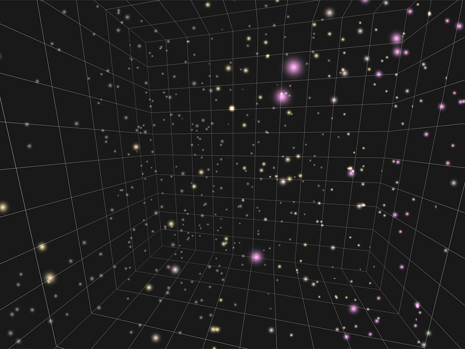

<link rel="stylesheet" href="../particles.css">

Now that we have some of the basic infrastructure in place to setup and display a buffer full of particles. But particles that just sit there aren't much fun! We want them to move!

## Putting it in motion
To get the particles moving, we'll introduce a new compute function to our program: `particleUpdate()`.

Like `particleInit()` this will also be dispatched for every particle in the buffer, but instead of being called once at startup it'll be called every frame. That will allow us to animate the particles by tweaking their position (or any other particle attributes) over time.

To keep things simple initially let's try an effect that resembles rain or snow: The particles will move downward until they reach the bottom of our grid box, then reappear at the top again.

FIXME

## Controlling particle lifetime

FIXME

## Getting the timing right

FIXME

  
<b>Click here if you want to know why I'm not using the browser's timestamp</b>

  You may have read the above section and wondered why I'm not simply using the timestamp that the browser provides, either through the `requestAnimationFrame()` callback or from the `performance.now()` method. The answer is that I _am_ using them internally to calculate the `delta`, but there's several reasons why I *don't* want to use that directly as the `time` we're passing to the compute shaders.

  First is that I'm doing some work behind the scenes to capture long deltas (greater than 1s) between frames and skip them. This might be due to the user switching tabs or minimizing the windows and then coming back later, or there could just be a long hang as the system does something else. Either way, if the delta suddenly comes back as 20s when the usual expectation is in the realm of 0.016s you can get some strange looking discontinuities. So I'm omitting those from the deltas, but if we passed the browser-provided timestamp to the shader then you'd start having large jumps in the timestamp but NOT the delta, which could lead to it's own issues depending on how the particle system is set up.

  Similarly, our `speedMultiplier` control can affect both the delta _and_ the timestamp if we're tracking the timestamp ourselves, making sure that our system runs the same at half speed or 2x speed.

  And finally, by tracking our own timestamp based off the deltas we can guarantee that it always starts at zero, which is nice both from a predictability standpoint and helps floating point precision if the system runs for a *really* long time.

## Controlling the rate of emission

FIXME

## Reducing unnecessary compute

FIXME

<a class='button is-primary prev-page' href='../01-setup/'>Setting Up</a>
