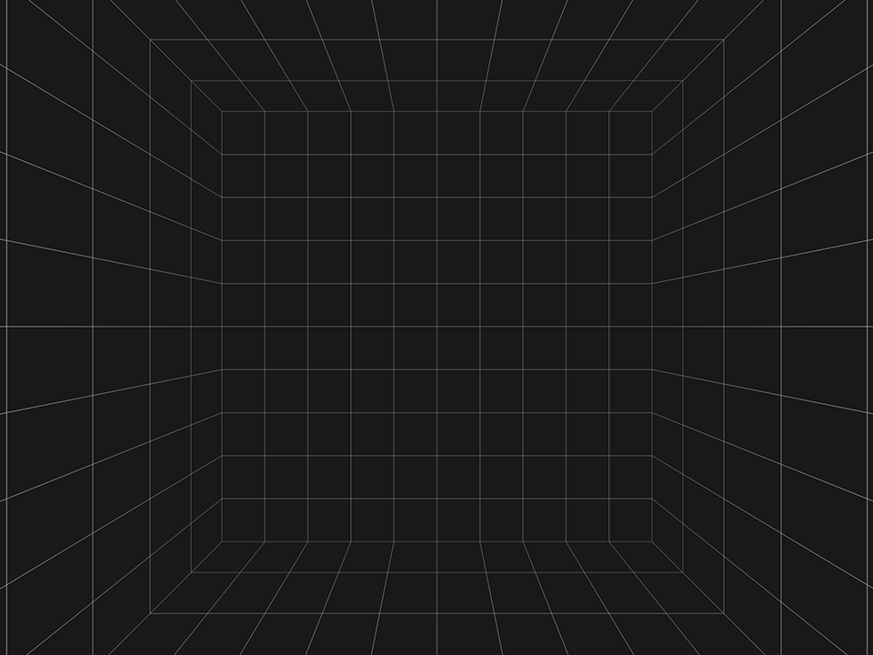

<link rel="stylesheet" href="particles.css">

## Introduction

**With WebGPU a new way of harnessing your GPU's computational ability is avilable to the web for the first time.** With Compute Shaders, it's now easier and more efficient than ever to put your GPU to work on crunching through large, highly parallel workloads. But making use of that capability effectively can sometimes be difficult, and new development patterns are required to make the most of it.

This article will walk through the development of a feature that is well suited to taking advantage of compute shaders: A Particle system. Using this particle system as an example we'll talk about patterns for handling data in a compute-friendly way, optimization considerations, and tying it together with WebGPU's rendering capabilities.

### What's a particle system?
A [particle system](https://en.wikipedia.org/wiki/Particle_system) is a commonly used technique in rendering where an effect that's hard to model with traditional meshes is instead represented as many simulated points, each following their own logic for how to move and display. If you've played pretty much any game made over the past couple of decades you've definitely seen them in action.

Take this short GIF from _The Legend of Zelda: Breath of the Wild_


A huge chunk of what you see there is made up of particles!

 - The fire on the ground? Particle system.
 - The air currents rising up from the fire? Particle system.
 - The energy beams gathering on the arrow? Particle system.
 - The explosion? Particle system.
 - The sparks? Par-ti-cle system!

Or maybe you want a less flashy example? How about this GIF of Mario jumping rope.


All of the dust effects from Mario jumping, landing, and the rope hitting the ground are handled via particle systems as well.

So as you can see particle systems have a lot of applications and can create wildly different effects depending on how they're configured.

Now, I'll be honset: We're not going to end this article with anything quite as pretty as the examples above because creating a good particle effect requires great art direction, and that's not something I claim to be able to deliver. But, hopefully by the time we're done here you'll have a good understanding of the technical side of things.

### What we'll be covering
We'll spend the first part of this article building out a simple GPU-driven particle system, using compute shaders for initializing, emitting, and updating the particles, as well as the accompanying render logic for displaying it. Once all of the fundamentals are in place we'll talk about extending it to handle various common needs such as sorting the particles, having them interact with the scene, and so on. We'll also do some profiling and optimization to make things more efficient. And there's a good chance that even after this article has been published I'll come back to it and add new sections detailing how to achive some specific effect.

What we won't be doing is spending much time on packaging things up in an easy-to-use library. This article and the accompanying code are focused on explaining the how and why, making it release-ready is left as an excersize for the reader. 😉

### Couldn't you do this with WebGL?
Yes! There's plenty of examples of people using WebGL or WebGL 2 to build interesting, GPU-accelerated particle systems. [Including me!](https://toji.github.io/webgl2-particles-2/) ([Source](https://github.com/toji/webgl2-particles-2)). So what does WebGPU bring to the table that we couldn't do before?

The biggest thing is simply ergonomics. While you could do these sorts of operations with WebGL you needed to be able to state everything in terms of rendering, even when what you were trying to do was a more general computation. Inputs and outputs would frequently need to be structured as textures, which led to some unnatural packing of data in order to fit into the usual RGBA channels. Transform Feedback helped in this regard somewhat, but it wasn't a well optimized path on a lot of hardware.

There were efficiency issues as well, since it was more difficult to control the number of elements that were being operated on, since you were typically dispatching workloads in terms of pixels in a render target. Plus any effects that required multiple passes over the data would tend to be more expensive given that render passes are generally heavier-weight than individual compute dispatches.

With compute shaders we can more naturally express the types of operations we want to perform with data that is more easily structured in the format that we want, and more easily limit it to the data ranges we care about. It's not without it's own caveats, but in almost every way it's an improvement that offers easier development and better performance potential. (And hey, if you really want to do everything in a render pass still WebGPU will gladly oblige.)

### There's no "right way".
One last important thing to note before we get started: This article will not teach you the "right way" to do things. That's because _there is no single, universally agreed upon, correct way to do these things!_ That applies not only to gpu-driven particle systms, but any GPU API usage! (And, in fact, software development in general.) Everything we build is a series of trade-offs: sacrificing flexibility for performance, increasing complexity in favor of expressiveness, taking shortcuts because we know we won't need features, etc. Only you know about your unique goals and constraints, and so only you can gauge how to best satisfy them.

All of which is to say that nothing I write here should be seen as an authoritive statement of the _only_ way to accomplish our task. Instead, I'll do my best to explain why I make the choices I do and talk about alternative approaches where appropriate. The goal is to help you better understand some of the considerations that go into designing these sorts of systems so that you can make well informed decisions in your own code!

So with that said, let's get started!

## Setting up

I'll be using a small demo "base" class to run the examples embedded throughout this article. You don't have to be familiar with it to follow along, just know that I'll be structuring everything like so:

```ts
export class ParticleDemo {
  async onInit(device: GPUDevice) {
    // Initialization stuff goes here
  }

  onFrame(device: GPUDevice, context: GPUCanvasContext, delta: number) {
    // Per-frame logic and rendering goes here

    // delta is the time in seconds since the last onFrame call, expected to be
    // something like 0.016 for an app running at 60 FPS.
  }
}
```

_**Note**: I'll be formatting my code snippets as TypeScript purely out of personal preference, but rest assured that everything we'll be talking about applies to vanilla JavaScript as well._

Things like WebGPU device creation, canvas resizing, input handling, and so on aren't the focus here, so they're largely going to be omitted. If you want to learn more about those aspects of using WebGPU first, may I suggest the excellent [WebGPU Fundamentals](https://webgpufundamentals.org/)?

Embedded examples will show up like this:

<a class='demo-link' href='https://toji.github.io/webgpu-particles/0.html'>
  
</a>

You can click and drag to rotate them and scroll/pinch to zoom. And that's really all you need to know!

<details markdown=block>
  <summary markdown=span><b>Click here if you want to learn more about how the demo base class works</b></summary>

  Feel free to [look at the code](https://github.com/toji/webgpu-particles/blob/main/src/demo-base/webgpu-demo.ts) for my demo base class, or even use it for your own code if you want!

  Here's the actual, complete file for setting up the basic demo environment seen above:

  ```ts
  import { WebGpuDemo } from './demo-base/webgpu-demo.js'
  import { GridRoom } from './demo-base/grid-environment.js'

  export class ParticleDemo extends WebGpuDemo {
    grid: GridRoom;

    async onInit(device: GPUDevice) {
      this.grid = new GridRoom(this);
    }

    onFrame(device: GPUDevice, context: GPUCanvasContext, delta: number) {
      const commandEncoder = device.createCommandEncoder();

      const renderPass = commandEncoder.beginRenderPass({
        ...this.defaultRenderPassDescriptor,
        timestampWrites: this.timestampHelper.timestampWrites("render")
      });

      this.cameraBindings.bind(renderPass);
      this.grid.draw(renderPass);

      renderPass.end();

      this.timestampHelper.resolve(commandEncoder);
      device.queue.submit([commandEncoder.finish()]);
    }
  }

  const demo = new ParticleDemo();
  ```

  The `WebGpuDemo` class handles most everything, creating a full-page WebGPU canvas with an appropriate `GPUDevice`. It also internally sets up some simple mouse and touch interaction to drive the camera. You can click and drag to rotate the scene around, as well as zoom with either a mouse scroll or pinch gesture.

  Once WebGPU is initialized it calls `onInit()` to give us a chance to create any WebGPU resources needed. Here we're creating an instance of my `GridRoom()` helper class which is just a cube that renders with a simple grid pattern. I find that to be helpful for giving some perspective to the stuff that we're rendering and providing a quick visual indication of if *anything* is rendering properly.

  After the `onInit()` call is finished the demo class kicks off the frame loop, which calls `onFrame()` every cycle. This is where we do any logic updates and rendering. You can see in this base demo the only thing we're doing at the moment is building a render pass that draws the previously created grid room.

  Note that I'm calling `this.cameraBindings.bind(renderPass);` before rendering the room. This sets uniforms such as the camera matrices computed by the demo class, to bind group 0. When set `@group(0) @binding(0)` will be populated with the following struct:

  ```rs
  struct CameraUniforms {
    projection: mat4x4f,
    view: mat4x4f,
    position: vec3f,
  }
  ```

  The `GridRoom` helper already makes use of those camera bindings, and in pipelines we create we can access the bind group layout for those bindings by calling `CameraBindings.getBindGroupLayout(this.device)`.

  In the code snippets throughout this article I'll be simplifying those to opaque references to `cameraBindGroupLayout` and `cameraBindGroup` in JavaScript, and `camera` uniforms in shaders without worrying too much about where they come from.

  Also note that in the call to `beginRenderPass()` we're setting `timestampWrites` to `this.timestampHelper.timestampWrites("render")`, and before finishing the command encoder we call `this.timestampHelper.resolve(commandEncoder);` This is a helper that the demo class uses to gather timestamps from render and compute passes, which then automatically surfaces that pass timing information in a UI for each demo, which I find to be really useful and informative! I'll be omitting those from code snippets, though, to reduce visual clutter.

  The scripts are all linked in a really bare-bones HTML file, like so:

  ```html
  <!doctype html>

  <html>
    <head>
      <meta charset='utf-8'>
      <meta name='viewport' content='width=device-width, initial-scale=1, user-scalable=no'>
      <meta name='mobile-web-app-capable' content='yes'>
      <meta name='apple-mobile-web-app-capable' content='yes'>

      <title>Particle System - WebGPU</title>
    </head>
    <body>
      <script type="module" src='./dist/0.js'></script>
    </body>
  </html>
  ```

  And that gives us the example above!
</details>

<a class='button is-primary next-page' href='./basics'>Particle Basics</a>

<!--Must be at the bottom of the article or it won't pick up the demo links-->
<script src='embedded-demos.js'></script>