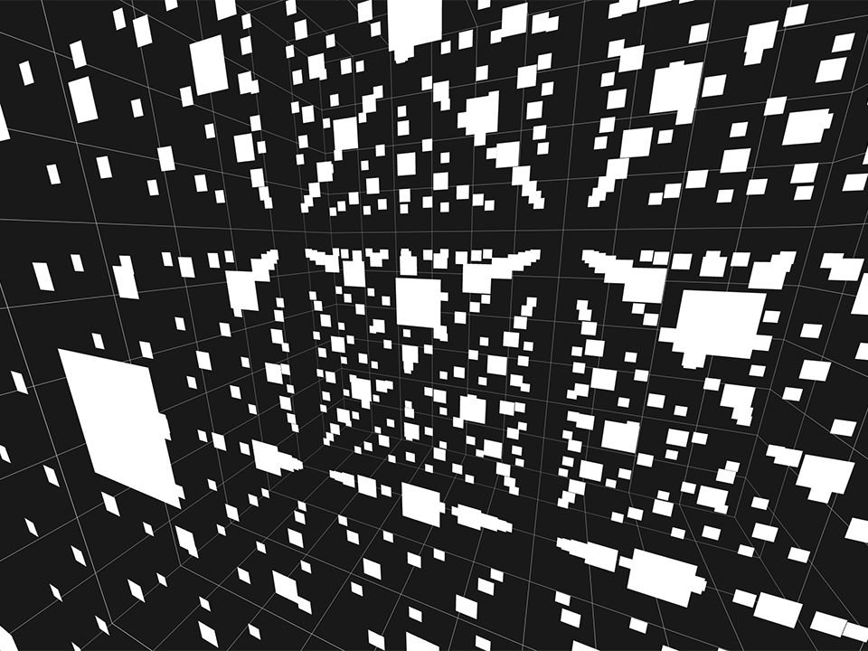
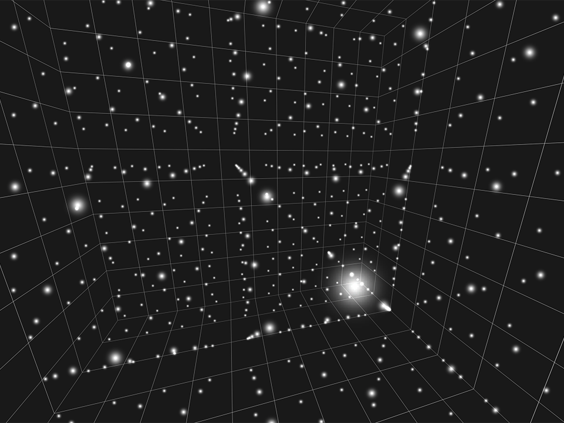
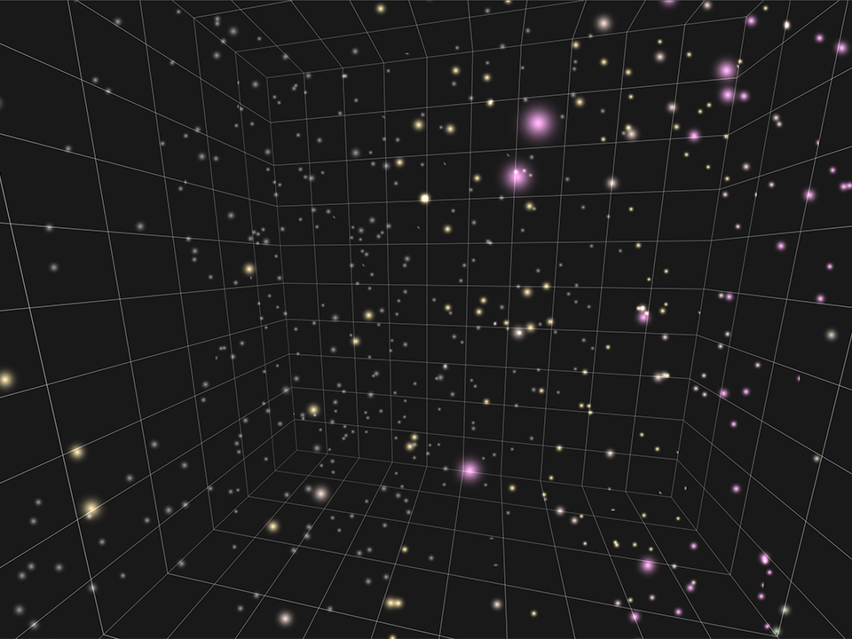

## Introduction

**With WebGPU a new way of harnessing your GPU's computational ability is avilable to the web for the first time.** With Compute Shaders, it's now easier and more efficient than ever to put your GPU to work on crunching through large, highly parallel workloads. But making use of that capability effectively can sometimes be difficult, and new development patterns are required to make the most of it.

This article will walk through the development of a feature that is well suited to taking advantage of compute shaders: A Particle system. Using this particle system as an example we'll talk about patterns for handling data in a compute-friendly way, optimization considerations, and tying it together with WebGPU's rendering capabilities.

### What's a particle system?
FIXME

### What we'll be covering
We'll spend the first part of this article building out a simple GPU-driven particle system, using compute shaders for initializing, emitting, and updating the particles, as well as the accompanying render logic for displaying it. Once all of the fundamentals are in place we'll talk about extending it to handle various common needs such as sorting the particles, having them interact with the scene, and so on. We'll also do some profiling and optimization to make things more efficient. And there's a good chance that even after this article has been published I'll come back to it and add new sections detailing how to achive some specific effect.

What we won't be doing is spending much time on packaging things up in an easy-to-use library. This article and the accompanying code are focused on explaining the how and why, making it release-ready is left as an excersize for the reader. 😉

### Couldn't you do this with WebGL?
Yes! There's plenty of examples of people using WebGL or WebGL 2 to build interesting, GPU-accelerated particle systems. [Including me!](https://toji.github.io/webgl2-particles-2/) ([Source](https://github.com/toji/webgl2-particles-2)). So what does WebGPU bring to the table that we couldn't do before?

The biggest thing is simply ergonomics. While you could do these sorts of operations with WebGL you needed to be able to state everything in terms of rendering, even when what you were trying to do was a more general computation. Inputs and outputs would frequently need to be structured as textures, which led to some unnatural packing of data in order to fit into the usual RGBA channels. Transform Feedback helped in this regard somewhat, but it wasn't a well optimized path on a lot of hardware.

There were efficiency issues as well, since it was more difficult to control the number of elements that were being operated on, since you were typically dispatching workloads in terms of pixels in a render target. Plus any effects that required multiple passes over the data would tend to be more expensive given that render passes are generally heavier-weight than individual compute dispatches.

With compute shaders we can more naturally express the types of operations we want to perform with data that is more easily structured in the format that we want, and more easily limit it to the data ranges we care about. It's not without it's own caveats, but in almost every way it's an improvement that offers easier development and better performance potential. (And hey, if you really want to do everything in a render pass still WebGPU will gladly oblige.)

### There's no "right way".
One last important thing to note before we get started: This article will not teach you the "right way" to do things. That's because _there is no single, universally agreed upon, correct way to do these things!_ That applies not only to gpu-driven particle systms, but any GPU API usage! (And, in fact, software development in general.) Everything we build is a series of trade-offs: sacrificing flexibility for performance, increasing complexity in favor of expressiveness, taking shortcuts because we know we won't need features, etc. Only you know about your unique goals and constraints, and so only you can gauge how to best satisfy them.

All of which is to say that nothing I write here should be seen as an authoritive statement of the _only_ way to accomplish our task. Instead, I'll do my best to explain why I make the choices I do and talk about alternative approaches where appropriate. The goal is to help you better understand some of the considerations that go into designing these sorts of systems so that you can make well informed decisions in your own code!

So with that said, let's get started!

## Step 0: Setting up
For this article, I've got a base "demo" class in place that handles a lot of the basics needed for a simple WebGPU app: device and canvas setup, basic orbit camera controls, resizing, a simple environment, and stuff like that. You can go [look at the code](FIXME) if you want, but the point is that I'm hiding it in a library because none of it is particularly important to what we want to focus on: The particle system. There are a couple of bits of it that will interact with the code we're building, though, so let's run through those really quick.

FIXME

## Step 1: Initializing Particles
Now that we have a simple environment to work in, lets get started on the star of the show: the particles! As a first step, we're only going to initialize a set of particles to some easy-to-verify state and draw them as simple white squares. Not particularly exciting or pretty, but it'll give us a good starting point to layer more interesting features onto!

FIXME

As you can see, this isn't particularly attractive but it _does_ demonstrate that we are able to place the particles where we want in the compute shader and then render them without the particle data ever touching the CPU! So it's a good start.

## Step 2: Textured billboards
While there may be some visual styles where flat shaded quads as particles may fit well, most particle systems you see render their particles as **textured billboards** to achieve the effect that they want. "Billboard" in this case means a quad that is always rotated so that it faces towards the camera. (Enemies in the original Doom were billboards, for example.) By billboarding our particles we can better hide the fact that they're simply flat planes, especially if the texture used is roughly spherical in appearance, since that makes it even harder to tell that they're rotating to face the camera all the time.

FIXME

It's worth noting that some particle effect may not want this billboarded appearance! For example, you can imagine a system where the particles were leaves falling from a tree: allowing the particles to render as flat quads that rotated and flutter as they fall could be exactly what you want! Also, the particles don't _have_ to be quads, they could be full meshes and the instancing would work exactly the same. We're just rendering them as quads here for simplicity.

## Step 3: Putting it in motion
Of course, particles that just sit there aren't much fun. We want them to move! And to that end we'll introduce a new compute function to our program: `particleUpdate()`.

Like `particleInit()` this will also be dispatched for every particle in the buffer, but instead of being called once at startup it'll be called every frame. That will allow us to animate the particles by tweaking their position (or any other particle attributes) over time.

To keep things simple initially let's try an effect that resembles rain or snow: The particles will move downward until they reach the bottom of our grid box, then reappear at the top again.

FIXME

<!--Must be at the bottom of the article or it won't pick up the demo links-->
