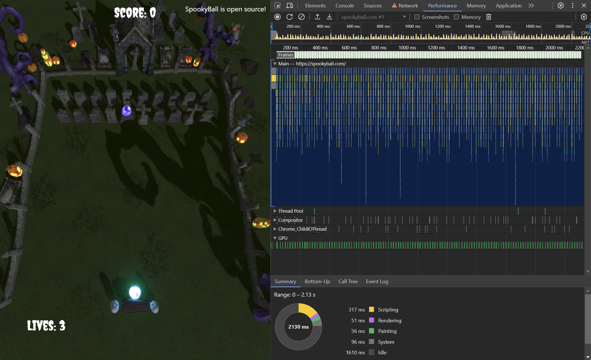
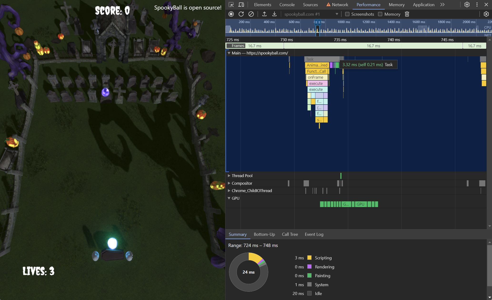
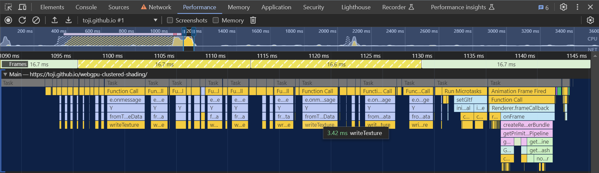
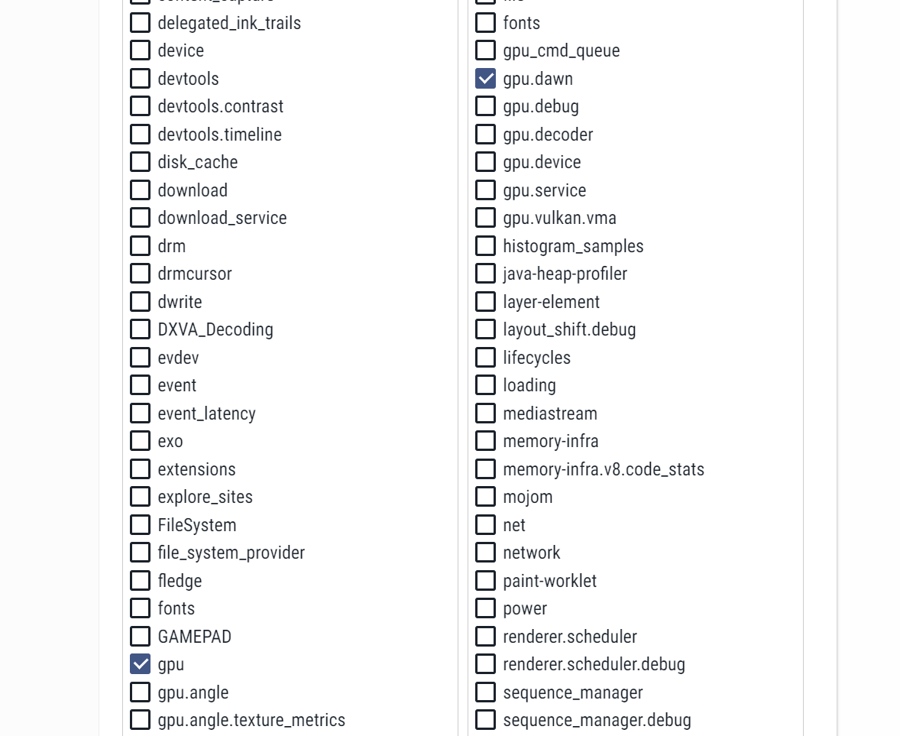
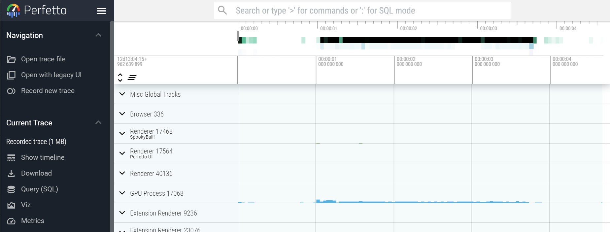
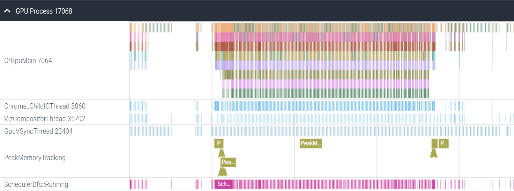

# CPU-side profiling

While we are using a GPU API, it's worth noting that your first stop when monitoring performance should be to ensure the _CPU_ side of things is running smoothly. After all, if you are trying to run your rendering at 60 frames per second but you're spending 30ms in JavaScript to submit the commands for each frame then you're simply never going to hit your target no matter how fast your GPU is!

### Chrome dev tools

The first place you should turn to in any web profiling situation is the browser's [built-in dev tools](https://developer.chrome.com/docs/devtools). If you're a web developer you're probably already familiar with at least some of these tools for viewing the developer console, setting breakpoints, and stepping through code. In not, [go read up on it](https://developer.chrome.com/docs/devtools/overview)! They're incredibly useful!

For profiling specifically you'll want to pay attention to the [Performance tab](https://developer.chrome.com/docs/devtools/performance). This tab allows you to record profiling snapshots of the page while it's running, which can then be displayed as flame graphs. Here's an example of me capturing a couple of seconds of [spookyball.com](https://spookyball.com)

We can zoom in with the scroll wheel to see a single frame's worth of calls.

The frame boundaries are shown at the top of the graph here, and you can see in this case the frame's JavaScript calls fit nicely within them. Mousing over the top of the graph shows that it only takes up 3.3ms out of the 16.7ms available to process the frame for our code to execute. That's great!

Here's an example of a profile from a different page where I missed the frame budget. In this case it was because the page was loading a lot of textures all at once and a high number of consecuitive `writeTexture()` calls (each taking about 3ms) caused the page to miss a few frames. This happened to be during page load, so I'm OK with it, but the point is that the flame graph can tell me where my JavaScript is spending it's time so I can focus optimizations where needed. (A good optimization option here, if I wanted it to be smoother, would be to force these `writeTexture()` calls only perform once or twice per frame, staggering them across multiple frames.)

Something to note, however, is that given the nature of how they're profiled, this graph will likely _not_ show you the timing for every method you call! The sampling will frequently skip over short calls or group many adjacent calls to the same function into one bar on the graph. That means you'll see things like just a `beginRenderPass()` call show up but none of the calls within that pass. Or you'll see a single `setBindGroup()` block that seems fairly large, but in actuality represents a group of them being called in quick succession. Long running calls are far more likely to be captured accurately, though, so it's still a highly effective tool for identifying bottlenecks.

A word of caution, though: The performance tab generally only captures the code being run by the page being profiled. Browsers are complex applications that frequently coordinate lots of work between not only different threads but entirely different processes! As a result, this only shows us the surface level of the work being done. To drill deeper we need a tool like...

### Perfetto

[Perfetto](https://ui.perfetto.dev/) is a general profiling tool that was designed to replace the older cross-process tracing utility found in Chrome (which you can still access by navigating to chrome://tracing a the time of this writing.) It allows us to capture profiles of what's happening in Chrome's GPU process, among others, which is the process that actually interfaces with the GPU driver.

Whereas the Chrome dev tools can easily show how much time the page is spending in JavaScript calls, these browser-wide traces can reveal if there are bottlenecks occuring in the WebGPU implementation as it communicates with the graphics hardware.

You'll want to reference [the Perfetto docs](https://perfetto.dev/docs/quickstart/chrome-tracing) for all the details on how to capture a trace in Chrome, but the high level steps are:

 - Select "Record a new Trace" from the menu on the left
 - If it's your first time running the tool, install the [Perfetto Chrome extension](https://chrome.google.com/webstore/detail/perfetto-ui/lfmkphfpdbjijhpomgecfikhfohaoine)
 - Select "Chrome" as the target platform
 - Under the "Probes" section select the catergories you want to profile

That last step can look pretty intimidating, because there's a LOT of them. The good news is that if you're here for WebGPU profiling you don't need most of them! Typically I'll only enable the `gpu.dawn` category in the right column.

Then you can click "Start Recording", at which point you'll want to switch back to the tab your WebGPU code is running in, let it run for a moment (maybe performing some action you're trying to profile), then switch back to the Perfetto tab and click "Stop".

> Note: This captures data from _everything_ running in the browser at that point, which means every tab, all the extensions you have running, every background process, etc. I highly recommend minimizing the number of open tabs you have in the browser when you do this, just to reduce the noise. (Frequently I do this sort of profiling in Chrome canary so that I can have it only open the relevant pages and not capture the dozens/hundreds of tabs I almost certainly have open in my main browser.)

That will provide you with a screen that looks like this:

To see the browser's GPU communication, expand the row labeled "GPU Process" to see another flame graph.

To navigate this graph you'll need to use the "W" and "S" keys to zoom in and out, and the "A" and "D" keys to move left and right.

// TODO: Good example cases (Shader compilation)s

