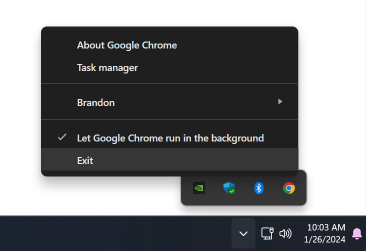
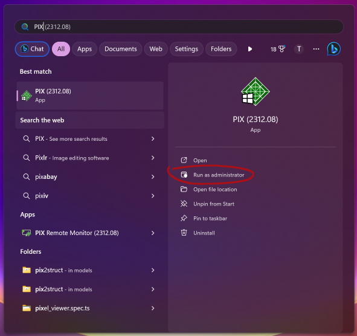
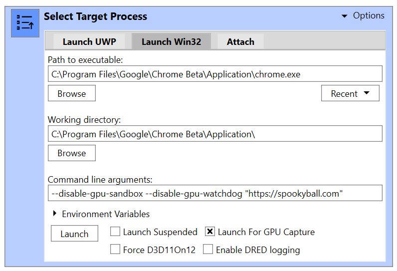
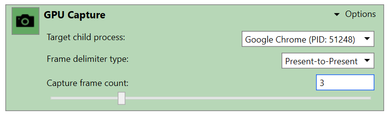
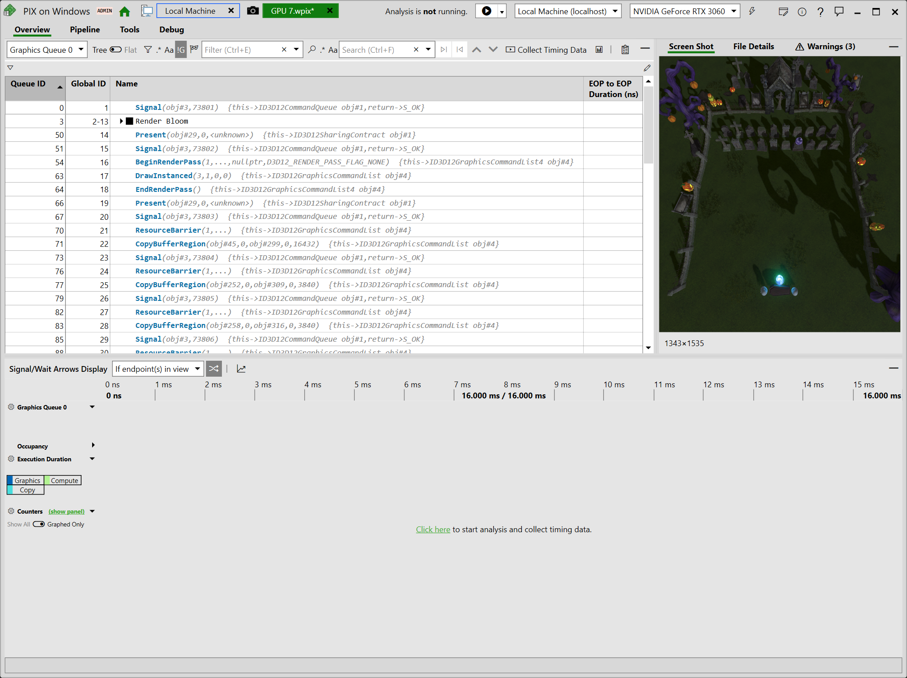
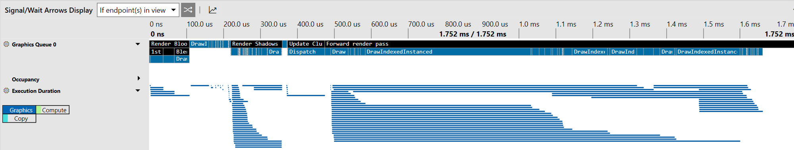

> Note: These steps are largely adapted and expanded from this [incredibly helpful gist by Popov72](https://gist.github.com/Popov72/41f71cbf8d55f2cb8cae93f439eee347) and the [debug marker documentation from the Dawn repo](https://dawn.googlesource.com/dawn/+/refs/heads/chromium/4479/docs/debug_markers.md).

## Microsoft PIX

[PIX](https://devblogs.microsoft.com/pix/download/) is a tool from Microsoft for graphics debugging of D3D11/12 applications. It's a well known, well supported, professional tool for detailed graphics debugging.

Since Chrome doesn't operate like your average game it takes a little it more jumping through hoops than usual to get PIX to play nicely with Chrome and capture our WebGPU pages, but the insight it can offer once you do is well worthwhile!

## Which Chrome channel?

First you should figure out what install of Chrome you're going to be profiling. It's not uncommon for developers to have multiple Chrome channels installed on their device, so take a moment to double check that you're using the right one.

The default install directories for each channel are:

 - Chrome Stable: `C:\Program Files\Google\Chrome\Application`
 - Chrome Beta: `C:\Program Files\Google\Chrome Beta\Application`
 - Chrome Dev: `C:\Program Files\Google\Chrome Dev\Application`
 - Chrome Canary: `C:\Users\<username>\AppData\Local\Google\Chrome SxS\Application`

We'll refer to whichever one you're using as `<Chrome Dir>`.

Also **make sure you completely exit any running instance** of the browser channel that you're going to be profiling. Chrome can keep running in the background by default even after you close it to in order to do things like provide push notifications, but if it's already running you'll have a much harder time attaching PIX to it properly. Usually the easiest way to exit Chrome fully is to click the Chrome icon in the Windows status bar, then click "Exit".



## Enabling Debug Markers

If you want to be able to see labels from WebGPU's [`pushDebugGroup()`/`popDebugGroup()` calls](https://gpuweb.github.io/gpuweb/#debug-markers) (and trust me, you do!) then you'll need to do one more bit of setup before we launch into PIX itself to enable Debug Markers.

 - Visit https://www.nuget.org/packages/WinPixEventRuntime and click the "Download package" link.
 - Rename the extension of the downloaded file from ``.nupkg`` to `.zip`, so you can open it in Explorer.
 - Find and copy the `bin\x64\WinPixEventRuntime.dll` file.
 - Paste it into the `<Chrome Dir>\<Version Number>` folder associated with the browser version you're running.
    - For example: `C:\Program Files\Google\Chrome\Application\121.0.6167.85`

If there are more than one version folder in `<Chrome Dir>`, it's usually a safe bet to pick the larger number, but you can run that Chrome channel and visit `chrome://version` to be sure. Also, whenever your browser install updates you'll need to copy the DLL into the new version folder again. For Chrome Canary that can be multiple time per day!


## Running Chrome in PIX

Now it's time to start debugging with PIX. If you haven't already, [download](https://devblogs.microsoft.com/pix/download/) and install it, then follow these steps:

- **Launch the PIX application as an administrator**
   - Right click on the app icon or search for the app in Start Menu and click "Run as Administrator"
   - This is necessary to get timing information from captures. If you don't run as an administrator you may get a E_PIX_MISSING_PERFORMANCE_LOGGING_PERMISSIONS error when trying to view timing data.



 - In the "Select Target Process" panel, click the "Launch Win32" tab and set the following fields:
    - Path to Executable: `<Chrome Dir>\chrome.exe`
    - Working Directory: `<Chrome Dir>`
    - Command Line Arguments: `--disable-gpu-sandbox --disable-gpu-watchdog`
    - If you want to see readable shader code in the capture add `--enable-dawn-features=emit_hlsl_debug_symbols,disable_symbol_renaming` to the Command Line Arguments as well.
    - You may also want to put the address of the page you're profiling at the end of the command line arguments string, so that it navigates to it automatically on launch.
 - Make sure "Launch for GPU capture" is checked
 - Click "Launch"



This will launch the browser. Navigate to the WebGPU content you want to profile, then go back to PIX and find the "GPU Capture" panel. Here you'll want to expand the "Options" dropdown and ensure that the "Capture Frame count" is something like 2-4. This is because in addition to capturing calls from your WebGPU application PIX will also see rendering commands from the browser compositor. Setting a higher number of frames increases the chances that you'll capture the WebGPU content that you intend to.



> Note: If the GPU Capture panel says "No target process has been selected, that's probably because the Chrome channel you picked was still running in the background. As explained above, make sure it's fully exited before launching from PIX.

If it captures the browser commands correctly, you'll see a screenshot of the captured content appear. Click it and it'll take you to the capture details, where you should be able to see every GPU command executed by your application.

Please keep in mind, however, that this capture represents the D3D12 commands that your WebGPU code was translated into, not the WebGPU commands directly. That means both that the function names will be different, the arguments may not always line up 1:1, and there will be additional commands in this stream that don't directly correspond to any WebGPU calls that you made. (This is especially true of resource barriers, which are handled implicitly by your WebGPU implementation.) Usually, though, it's not too hard to make connections between the commands you see here and the commands your page issues.



From here there's a lot you can do, such as view the values in buffers, see the state of a pass when an dreaw was issued, or see render targets be built up step-by-step. It's an incredibly powerful tool, and I don't have the time to cover even a fraction of what it can do here. For that you're better off looking through their [official docs](https://devblogs.microsoft.com/pix/documentation/).

## Timelines and Debug Groups

One thing I do want to highlight, however, is that you can see a timing breakdown of all the commands listed in the capture by clicking the "Click Here to start analysis and collect timing data." link in the bottom panel. This will produce a timeline that looks something like this:



You can mouse over or click on any of the bars here to see how long a given operation took on the GPU, as well as get a sense for the concurrency at play by seeing how the bars overlap. Of course, it's easy to get lost in a sea of draw calls if you don't have any indication as to what they're for, and that's where the Debug Markers mentioned previously come in! You can see in the above screenshot a set of black bars with plain text labels like "Render Bloom", "Render Shadows", and "Forward Render Pass". Those are labels that I set in my WebGPU code, which (because I followed the steps in the "Enabling Debug Markers" section of this doc) are being passed all the way down to this native debugging tool.

The code in my page looks something like this:

```js
const commandEncoder = device.createCommandEncoder({});
commandEncoder.pushDebugGroup('Render Bloom');

  commandEncoder.pushDebugGroup('1st Pass (Horizontal Blur)');
    let passEncoder = commandEncoder.beginRenderPass(/*...*/);
    passEncoder.setPipeline(this.blurHorizonalPipeline);
    passEncoder.setBindGroup(0, this.pass0BindGroup);
    passEncoder.draw(3);
    passEncoder.end();
  commandEncoder.popDebugGroup();

  commandEncoder.pushDebugGroup('2nd Pass (Vertical Blur)');
    passEncoder = commandEncoder.beginRenderPass(/*...*/);
    passEncoder.setPipeline(this.blurVerticalPipeline);
    passEncoder.setBindGroup(0, this.pass1BindGroup);
    passEncoder.draw(3);
    passEncoder.end();
  commandEncoder.popDebugGroup();

  // Blend pass
  commandEncoder.pushDebugGroup('Blend Pass');
    passEncoder = commandEncoder.beginRenderPass(/*...*/);
    passEncoder.setPipeline(this.blendPipeline);
    passEncoder.setBindGroup(0, this.blendPassBindGroups);
    passEncoder.draw(3);
    passEncoder.end();
  commandEncoder.popDebugGroup();

commandEncoder.popDebugGroup();

device.queue.submit([commandEncoder.finish()]);
```

Note that the debug groups can be nested! (See [WebGPU error handling best practices](../webgpu-best-practices/error-handling) for more information on using debug groups and labels.)

You can see each debug group I set here both in the timeline and in the list of captured commands, where each group can be collapsed and expanded for easier navigation. This makes it **far** easier to correlate the commands you see here with the ones being made by your page, and helps highlight where the majority of the GPU time is going in your page.

## "The requested resource is in use"

One last tip I'll leave you with is that if you start getting errors from PIX stating "The requested resource is in use" when trying to capture timing information, try temporarily disabling "Real-time protection" in Window's "Virus and Threat protection settings". This doesn't seem to be a super common problem, but it's one that I lost an hour or two of troubleshooting to, so I figured it was worth a mention here!

## Good luck!

This was just a brief overview of getting started with PIX, but I hope you found it useful. Graphics debuggers like this are a fantastic way to gain insight into the behaviors and performance of your WebGPU application, and I encourage everyone to make good use of them!