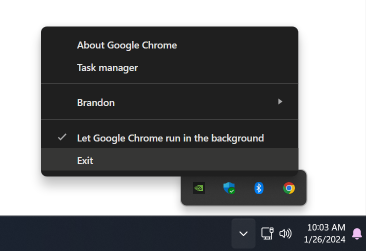

> Note: At the time of this writing **these steps only work for Chrome when using WebGPU's D3D12 backend (the default) on Windows, in Chrome v144 or higher.** Obviously Renderdoc works in more places, and we would like to expand it's accessibility. I'll update this page when that becomes accessible. These steps are largely adapted and expanded from the [documentation](https://dawn.googlesource.com/dawn/+/refs/heads/main/docs/dawn/debugging.md#capturing-with-renderdoc-in-chrome) by my colleage on the Chrome team, Antonio Maiorano, who also added the necessary hooks for RenderDoc to attach to Chrome's WebGPU implemenation.

## Renderdoc

[RenderDoc](https://renderdoc.org/) is a popular open-soruce tool for graphics debugging of applications across multiple APIs and platforms. It's a staple of the graphics development community!

Unfortunately since Chrome doesn't operate like your average game it's not very obvious or intuitive to get RenderDoc to connect to Chrome and capture the GPU commands our pages submit, but it can be done!

## Which Chrome channel?

> **IMPORTANT:** Capturing with RenderDoc **requires Chrome v144 or higher**, which at time of writing was only available in Chrome Canary.

First you should figure out what install of Chrome you're going to be profiling. It's not uncommon for developers to have multiple Chrome channels installed on their device, so take a moment to double check that you're using the right one.

The default install directories for each channel are:

 - Chrome Stable: `C:\Program Files\Google\Chrome\Application`
 - Chrome Beta: `C:\Program Files\Google\Chrome Beta\Application`
 - Chrome Dev: `C:\Program Files\Google\Chrome Dev\Application`
 - Chrome Canary: `C:\Users\<username>\AppData\Local\Google\Chrome SxS\Application`

We'll refer to whichever one you're using as `<Chrome Dir>`.

Also **make sure you completely exit any running instance** of the browser channel that you're going to be profiling. Chrome can keep running in the background by default even after you close it to in order to do things like provide push notifications, but if it's already running you'll have a much harder time attaching RenderDoc to it properly. Usually the easiest way to exit Chrome fully is to click the Chrome icon in the Windows status bar, then click "Exit".



## Running Chrome with RenderDoc

Now it's time to start capturing Chrome commands. If you haven't already, [download](https://renderdoc.org/builds), install, and launch it.

### First time setup
The **first time you run RenderDoc only** you'll need to enable process injection. To do so open the Settings dialog under `Tools > Settings`


In that dialog, check the "Enable Process Injection" option.


Then close and restart RenderDoc.

### Hooking Chrome

At this point Chrome must be hooked by RenderDoc at startup for captures to work. To do so:

- **Open a command prompt (_not_ PowerShell)**
  - Easiest way is to click the start button and type "cmd", then press enter.
- **Run the following command:**
  - Make sure that you substituite `<Chrome Dir>` in the command below for the correct path on your machine.
  ```
  set RENDERDOC_HOOK_EGL=0 && "<Chrome Dir>\chrome.exe" --no-sandbox --disable-gpu-sandbox --disable-direct-composition --gpu-startup-dialog --enable-dawn-features=enable_renderdoc_process_injection
  ```

- **Optionally,** you may want to add the URL that you wish to open to the end of the command above, as that will cause it to open automatically when the browser starts.

This will launch Chrome but leave it as a blank window, with a smaller dialog labled "Google Chrome GPU" that contains a process ID number. (Note that the dialog may launch behind the main Chrome Window.) **The number in this dialog will be random each time**, so you'll have to check it on every launch.

_Do not click "OK" in this dialog yet!_


Once you know the process ID jump back to RenderDoc and open the `File > Inject into Process` menu item.


This displays a tab that shows all the processes currently running on the system. Type the process ID from the dialog into the search box at the bottom of the list to find the Chrome GPU process. If it doesn't show up try clicking the "refresh" button at the bottom of the list.

Double click on the process to enable captures.


Now you can go back to the "Google Chrome GPU" dialog and click "OK", allowing the browser to start as usual.

### Open a WebGPU page

Once the browser launches you should see an overlay in the top right corner of the browser. This indicates that RenderDoc successfully hooked the browser's rendering process.


 > Note: Ignore the bit about using F12/PrtScrn to capture. That unfortunately won't work for WebGPU. If you try it you'll capture the steps of the browser rendering itself, which is actually pretty cool and educational! Probably not what you were looking for, though.

Next, navigate to a page that has some WebGPU content. (https://webgpu.github.io/webgpu-samples/?sample=deferredRendering is a good one to test with!) Once you do you'll notice a series of "Captured user-defined capture" messages appear in the RenderDoc overlay, one for each frame.


The captures will continue as long as anything WebGPU is running, and the only way to stop it is to stop the WebGPU content, probably by closing the tab or the whole browser. Once you've done that you can jump back to RenderDoc and chould now see a series of captures on the tab for the hooked Chrome process.


### View the capture

Clicking on any of those will open the capture of that particular frame, including stepping through individual draw calls, viewing texture contents, visualizing meshes, and more! Read up on everything you can do in the [RenderDoc documentation](https://renderdoc.org/docs/index.html) if you're not familiar with it.


## Limitations

As you may have surmized from the above steps, there are some limitations to Chrome's ability to allow RenderDoc to capture WebGPU commands at this point. It currently only supports D3D12 (and, thus, is implicitly Windows only). Also, it currently captures EVERY frame produced by WebGPU, rather than allowing you to capture frames on demand. This may be difficult to make use of for larger applications where you need to launch the app and do some set up before reaching the desired capture point.

This is because RenderDoc typically watches for "frames" by hooking each API's `present` call. That is, whichever call in the API instructs the swapbuffer to be displayed on-screen. That's usually not a problem for apps like games that have fairly straightforward render loops. The complex requirements of rendering in a browser, however, means that those present calls either are never made or aren't handled in the same, easily observable way. As a result, attempting to have RenderDoc capture "frames" will leave it waiting for a signal that will never come.

To get around this Dawn (Chrome's WebGPU implemenation) is using the [RenderDoc API](https://renderdoc.org/docs/in_application_api.html) to manually begin and end captures at what the browser knows to be frame boundaries. Ideally this would be something that developers could explicitly trigger rather than happening for every frame, but as of this article's writing the feature is still in early development. Hopefully ergonomic improvements can be made in the future!

## Capturing WebGL

While not the focus of this document, it should be noted that RenderDoc can also capture WebGL commands, as detailed by [this helpful guide by Elias Daler](https://edw.is/renderdoc-webgl/).

## Good luck!

This was just a brief overview of getting started with RenderDoc, but I hope you found it useful. Graphics debuggers like this are a fantastic way to gain insight into the behaviors and performance of your WebGPU application, and I encourage everyone to make good use of them!