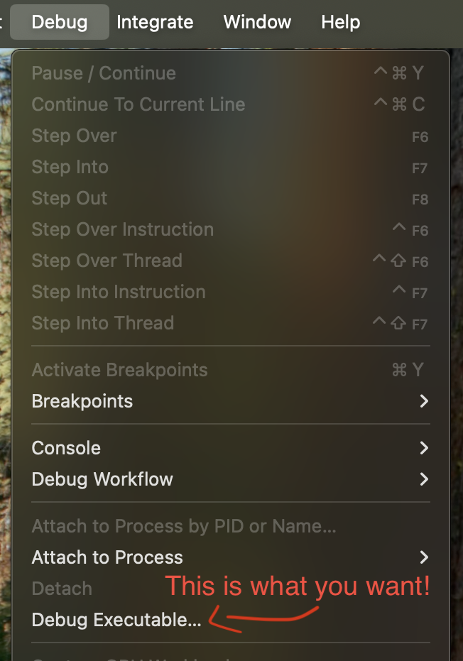

> Note: These steps represent the best process that I've discovered so far, but I'm also am largely unfamiliar with XCode and have found this entire process to be far more fragile than, for example, debugging with PIX. I would welcome any suggestions that make this process easier and/or more reliable!

## XCode

[XCode](https://developer.apple.com/xcode/) is Apple's IDE for all of their platforms, and contains many profiling and debugging tools. More to the point, XCode is apparently the _ONLY_ profiling tool available for Metal, which is a bit unfortunate for our needs as WebGPU developers.

Since Chrome doesn't operate like your average Mac application, and especially since it's not developed using XCode directly, it takes a lot more jumping through hoops than usual to get XCode to play nicely with Chrome and capture our WebGPU pages.

## Which Chrome build?

Unfortunately the standard Chrome builds that you get from Google are not debuggable out-of-the-box. They have been codesigned in a way that generally prevents debuggers like XCode from attaching to them. There are ways around this, however, as detailed on the [Debugging Chromium on MacOS page](https://chromium.googlesource.com/chromium/src/+/HEAD/docs/mac/debugging.md#chrome-builds). Namely, turning off System Integrity Protection or stripping the codesigning from the binary. See that page for more details.

The other option is to [build your own debug binary of Chromium](https://chromium.googlesource.com/chromium/src/+/main/docs/mac_build_instructions.md). And, well... building Chrome is an **adventure**.

So it's not exactly a fun process either way, which you'll see is going to become a running theme...

## Setting up XCode

Once you've prepared your Chrome build you'll need to get XCode ready. If you haven't already, [download it](https://apps.apple.com/us/app/xcode/id497799835) from the App Store.

When you first launch it after installing, Xcode will ask what platforms you want to support. The only one you need for these purposes is MacOS, which it lists as "Built In", so you should be good!

Then, you'll come to a Welcome screen that asks you to Create a new project or open an existing one. None of those options are what you want!


Instead you want to go to the `Debug` menu item and select `Debug Executable...`



This will open a dialog that asks you to select an application to debug, and we want to select the Chrome binary that we'll be capturing, but not because we'll be debugging it! The main reason we're selecting an application at all is because it gives us access to the `Attach to Process by PID or Name...` option later. But we can use the executable debugging options to set up several flags and other variables that will be helpful to us.

Selecting a Chrome executable will open the "Scheme" dialog like the one shown below. There's a few things we want to change here.

In the `Info` tab, uncheck the `Debug executable` checkbox. We DON'T want launching Chrome via XCode to try and attach a debugger!


In the `Arguments` tab:
 - Add `--disable-gpu-sandbox` to the `Arguments Passed On Launch` list
 - Add `--enable-dawn-features=use_user_defined_labels_in_backend` to the `Arguments Passed On Launch` list
 - Add `MTL_CAPTURE_ENABLED` with a value of `1` to the `Environmental Variables` list.
 - If you're going to be testing the same page repeatedly, it's useful to put it's URL as the last line of the `Arguments Passed On Launch`, which will cause Chrome to launch with that page open. 


In the `Options` tab, set `GPU Frame Capture` option select `Metal`.


 
Now you can click `Close`, at which point you'll be presented with an empty project.

> Note: If you need to get back to these settings later you can find them under `Product->Scheme->Edit Scheme`


Now you're ready to go!

## Preparing to capture

At this point if we click the triangular "Run" button at top of the project the Chrome executable we selected will launch with the arguments we specified, but XCode won't start debugging yet. That's good, because what we want to attach to isn't the main browser process, but the GPU process that typically runs in a sandbox behind the scenes.

Unfortunately the most direct way do that is a fairly annoying process. First, in Chrome open the Three Dot menu in the upper right, then navigate to `More Tools->Task Manager` (Alternatively you can go to `Window->Task Manager` on the main menu bar).


This will open up Chrome's built-in task manager. From there you need to click on the `Browser` tab and then look for the `GPU Process` entry. To the left this will have a `Process ID`. Memorize it or write it down, we'll need it for the next step!


> **WARNING:** The GPU Process ID will change every time Chrome launches! Sorry, but you need to look it up _Every. Single. Time._ (And don't use the one in the screenshot above! It won't work!)

Now jump back to XCode and click on `Debug->Attach to Process by PID or Name...`


That will open up a dialog where you can type the process ID of the Chrome GPU process that you looked up. I've found that you also need to set `Debug Process As` to `root` rather than the current user.


When you click `Attach` on that dialog if all goes well you should then see "Chromium/Chrome Helper (GPU)" in the project, and clicking on it will give you the tool bar we want near the bottom with a Metal "M" logo button. That's our capture button!


## Capturing a WebGPU page

Now that everything is ready to capture, navigate to the WebGPU content you want to profile. Once it's running and in the state that you want to profile, click the "M" button. That will give you this dialog:


The `Source` option will be set to `Frames` by default (every time), but that doesn't work for us! WebGPU (or WebGL for that matter) in Chrome doesn't produce "Frames" in the same way as a typical game or other GPU-driven app might. It does it's own scheduling, and as such doesn't end up calling `present` in the way that XCode expects, and thus it will never detect a new frame.

> Note: Chrome's WebGPU implementation may be able to improve on this in the future by making use of [MTLCaptureScope](https://developer.apple.com/documentation/metal/mtlcapturescope), but that hasn't been implemented at the time of this writing.

This leaves us with two other options for capturing. Opening up the `Source` options will display a list of Command Queues that have been submitting work, as well as a list of Devices to capture from.


The easy but noisy route is to select the Device and turn up the number of Command Buffers that it captures to at least 4 or 5, maybe more depending on if anything else is animating on your page. This is because this will capture ANYTHING the browser is rendering, including the page contents, browser UI, etc. If your WebGPU content is rendering consistently, though, and you don't have a lot of animations going, then you should hopefully pick up at least one frame of your WebGPU content, though you'll likely have to sort through a few command queues from the browser's rendering to find it.

The cleaner route would be to select a specific Command Queue from the list and capture just that. If you select the Command Queue created by WebGPU then you'll only capture submits from your WebGPU content! _However_, as you might notice from the screenshot above, there's nothing to differentiate the Command Queues. They also seem to appear in a semi-random order, so it's not like you can consistently pick the last one and know that it's going to be the WebGPU one. So while this has the potential to narrow the scope of your capture it's effectively a lottery.

> Note: You can set a label on a CommandQueue, and this seems like the perfect place for XCode to surface that label, right? Unfortunately the labels don't show up here and that's [apparently a known issue](https://developer.apple.com/forums/thread/768061). If that ever get's resolved it would make this part of the process easier. In the meantime if you happen to know of a way to better determine which command queue is which in this list I'd love to hear it!

Once you've got that all set up click the `Capture` button and wait for it to finish! (If the browser is minimized, on another desktop, or the page isn't animating you may need to open it and interact with it to produce enough submits to fulfill the capture limit you specified.)

### Big Important Caveat!

You should now have a Metal capture to browse through! Congratulations! However you may have noticed the browser has frozen, and even if you click the "Continue program execution" button in XCode... it doesn't come back.

It's not really clear to me why, but it appears that for the time being once you've snagged a Metal capture from Chrome with XCode the browser always hangs indefinitely and needs to be restarted. That means that **every capture is a one-shot affair**. You can get one good capture out of it before going through the entire process above, from "Preparing to Capture" down, over again. (This makes guessing at the Command Queue like I described above MUCH riskier!)

It's a MASSIVE pain, but I haven't found a way to avoid it yet. Disabling various watchdogs and hang detectors in Chrome doesn't appear to have an effect. It's not really clear to me why XCode needs to pause the application after a capture anyway, so if anyone knows of a way to avoid that PLEASE let me know!

## Debug labels and groups

To be honest I'm not very familiar with how XCode surfaces information in it's captures, so I can't give much in the way of detailed advice on how to interpret the results. It does surface a LOT of data, though, and there's a good chance that GPU resources from browser internals are mixed in there as well, so it can be difficult to narrow in on what you're looking for.

This is where labels come in! By default Dawn, Chrome's WebGPU implementation, will provide labels for everything along the lines of `Dawn_Buffer` or `Dawn_Texture`, but that's not particularly helpful when you're looking at a list full of dozens of identically named resources. But in your WebGPU code you can set your own [debug labels](../webgpu-best-practices/error-handling.md#debug-labels) on any object! As long as you included `--enable-dawn-features=use_user_defined_labels_in_backend` in your command line arguments as suggested above, those labels will then be passed through to XCode and appended to the Dawn default label. So something like:

```js
const buffer = gpuDevice.createBuffer({
  label: 'Player Vertices'
  size: PLAYER_MESH_VERTEX_SIZE,
  usage: GPUBufferUsage.VERTEX | GPUBufferUsage.COPY_DST
});
```

Will show up in Xcode's profiler as: `Dawn_Buffer_Player Vertices`.


Similarly, [Debug Groups](../webgpu-best-practices/error-handling.md#debug-groups) used by your page will also help XCode organize your GPU calls. Placing groups in your code like this:

```js
const commandEncoder = device.createCommandEncoder();
commandEncoder.pushDebugGroup('Main Frame');

  const computePass = commandEncoder.beginComputePass({/*...*/});
  computePass.pushDebugGroup('Update Lighting Clusters');
    // Update lighting clusters
  computePass.popDebugGroup();
  computePass.end();

  const renderPass = commandEncoder.beginRenderPass({/*...*/});
  renderPass.pushDebugGroup('Main Render Pass');
    // Draw
  renderPass.popDebugGroup();
  renderPass.end();

commandEncoder.popDebugGroup();
device.queue.submit([commandEncoder.finish()]);
```

Will produce folders in the capture to encapsulate the commands within them like so:


## Good luck!

This was just a brief overview of how to capture WebGPU work with XCode's Metal profiler, and I'm sure there are ways to improve this workflow. I'd be thrilled to hear about any steps that can be taken to improve it from the community! Nevertheless, I hope you found it useful. Graphics debuggers like this are a fantastic way to gain insight into the behaviors and performance of your WebGPU application, and I encourage everyone to make good use of them!
